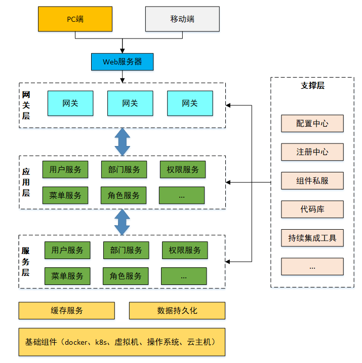
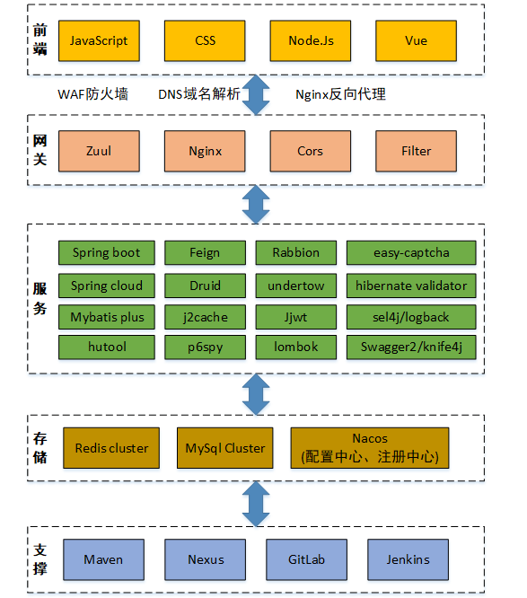
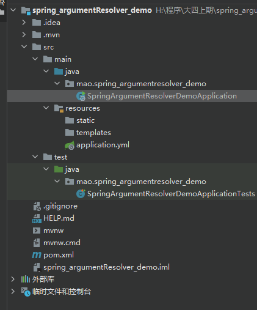
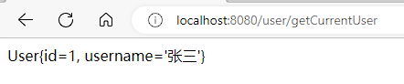
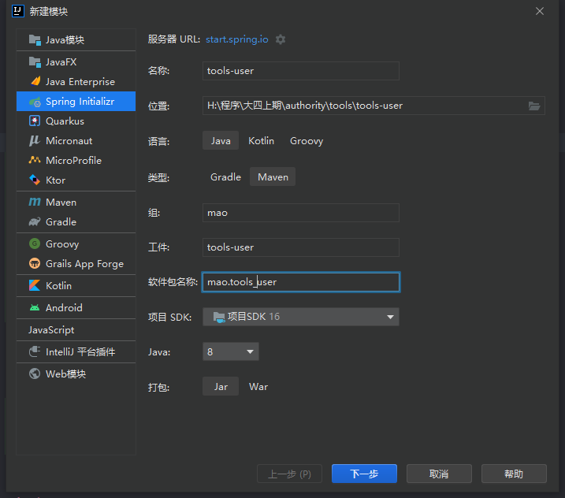
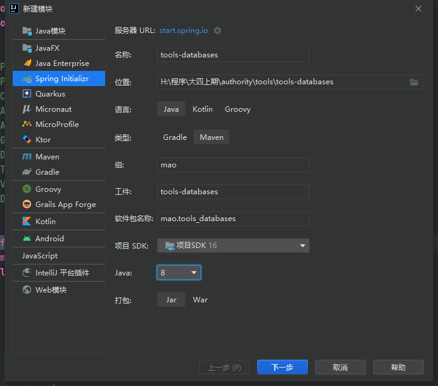

# 项目概述

## 项目介绍

对于企业中的项目绝大多数都需要进行用户权限管理、认证、鉴权、加密、解密、XSS防跨站攻击等。这些功能整体实现思路基本一致，但是大部分项目都需要实现一次，这无形中就形成了巨大的资源浪费。本项目就是针对这个问题，提供了一套通用的权限解决方案


具备通用的用户管理、资源权限管理、网关统一鉴权、XSS防跨站攻击等多个模块，支持多业务系统并行开发，支持多服务并行开发，可以作为后端服务的开发脚手架。核心技术采用SpringBoot、Zuul、Nacos、Fegin、Ribbon、Hystrix、JWT Token、Mybatis Plus等主要框架和中间件。


特性：

- 用户权限管理

  具有用户、部门、岗位、角色、菜单管理，并通过网关进行统一的权限认证

- 微服务开发框架

  本项目同时也是一个微服务开发框架，集成了基础的公共组件，包括数据库、缓存、日志、表单验证、对象转换、防注入和接口文档管理等工具。


## 业务架构





## 技术架构





## 服务注册和配置中心

本项目使用Nacos来作为服务的注册和配置中心。


# 项目模块介绍


```sh
authority                    #聚合工程，用于聚合parent、apps、tools等模块
├── parent				     # 父工程，nacos配置及依赖包管理
├── apps					 # 应用目录
	├── auth				 # 权限服务父工程
		├── auth-entity      # 权限实体
		├── auth-server      # 权限服务
	├── gateway			     # 网关服务
└── tools				     # 工具工程
	├── tools-common		 # 基础组件：基础配置类、函数、常量、统一异常处理、undertow服务器
	├── tools-core		     # 核心组件：基础实体、返回对象、上下文、异常处理、分布式锁、函数、树
	├── tools-databases	     # 数据源组件：数据源配置、数据权限、查询条件等
	├── tools-dozer		     # 对象转换：dozer配置、工具
	├── tools-j2cache	     # 缓存组件：j2cache、redis缓存
	├── tools-jwt            # JWT组件：配置、属性、工具
	├── tools-log	         # 日志组件：日志实体、事件、拦截器、工具
	├── tools-swagger2	     # 文档组件：knife4j文档
	├── tools-user           # 用户上下文：用户注解、模型和工具，当前登录用户信息注入模块
	├── tools-validator	     # 表单验证： 后台表单规则验证
	├── tools-xss		     # xss防注入组件
```


项目服务只有两个：网关服务和权限服务


## tools-swagger2

相信无论是前端还是后端开发，都或多或少地被接口文档折磨过。前端经常抱怨后端给的接口文档与实际情况不一致。后端又觉得编写及维护接口文档会耗费不少精力，经常来不及更新。其实无论是前端调用后端，还是后端调用后端，都期望有一个好的接口文档。但是这个接口文档对于程序员来说，就跟注释一样，经常会抱怨别人写的代码没有写注释，然而自己写起代码起来，最讨厌的，也是写注释。所以仅仅只通过强制来规范大家是不够的，随着时间推移，版本迭代，接口文档往往很容易就跟不上代码了。

使用Swagger你只需要按照它的规范去定义接口及接口相关的信息。再通过Swagger衍生出来的一系列项目和工具，就可以做到生成各种格式的接口文档，生成多种语言的客户端和服务端的代码，以及在线接口调试页面等等。这样，如果按照新的开发模式，在开发新版本或者迭代版本的时候，只需要更新Swagger描述文件，就可以自动生成接口文档和客户端服务端代码，做到调用端代码、服务端代码以及接口文档的一致性。

为了简化swagger的使用，Spring框架对swagger进行了整合，建立了Spring-swagger项目，后面改成了现在的Springfox。通过在项目中引入Springfox，可以扫描相关的代码，生成描述文件，进而生成与代码一致的接口文档和客户端代码。


## tools-dozer

tools-dozer模块定位为对象转换，其本质就是一个Spring Boot starter，其他模块可以直接导入此模块就可以直接完成对象转换了。


Dozer是Java Bean到Java Bean映射器，它以递归方式将数据从一个对象复制到另一个对象。 dozer是用来对两个对象之间属性转换的工具，有了这个工具之后，我们将一个对象的所有属性值转给另一个对象时，就不需要再去写重复的调用set和get方法了。dozer其实是对我们熟知的beanutils的封装。


## tools-validator

tools-validator模块定位为后端表单数据校验，其他模块可以直接引入tools-validator的maven坐标就可以使用其提供的表单校验功能。tools-validator底层基于hibernate-validator实现。


早期的网站，用户输入一个邮箱地址，需要将邮箱地址发送到服务端，服务端进行校验，校验成功后，给前端一个响应。

有了JavaScript后，校验工作可以放在前端去执行。那么为什么还需要服务端校验呢？ 因为前端传来的数据不可信。前端很容易获取到后端的接口，如果有人直接调用接口，就可能会出现非法数据，所以服务端也要数据校验。

总的来说：

-  前端校验：主要是提高用户体验
-  后端校验：主要是保证数据安全可靠

校验参数基本上是一个体力活，而且冗余代码繁多，也影响代码的可读性，我们需要一个比较优雅的方式来解决这个问题。Hibernate Validator 框架刚好解决了这个问题，可以以很优雅的方式实现参数的校验，让业务代码和校验逻辑分开,不再编写重复的校验逻辑。

hibernate-validator优势：

-  验证逻辑与业务逻辑之间进行了分离，降低了程序耦合度
-  统一且规范的验证方式，无需你再次编写重复的验证代码
-  你将更专注于你的业务，将这些繁琐的事情统统丢在一边


## tools-xss

tools-xss模块定位为防跨站脚本攻击（XSS），通过对用户在页面输入的 HTML / CSS / JavaScript 等内容进行检验和清理，确保输入内容符合应用规范，保障系统的安全。


XSS：跨站脚本攻击(Cross Site Scripting)，为不和 CSS混淆，故将跨站脚本攻击缩写为XSS。XSS是指恶意攻击者往Web页面里插入恶意Script代码，当用户浏览该页时，嵌入其中Web里面的Script代码会被执行，从而达到恶意攻击用户的目的。有点类似于sql注入。


XSS攻击原理：

HTML是一种超文本标记语言，通过将一些字符特殊地对待来区别文本和标记，例如，小于符号（<）被看作是HTML标签的开始，\<title>与\</title>之间的字符是页面的标题等等。当动态页面中插入的内容含有这些特殊字符时，用户浏览器会将其误认为是插入了HTML标签，当这些HTML标签引入了一段JavaScript脚本时，这些脚本程序就将会在用户浏览器中执行。所以，当这些特殊字符不能被动态页面检查或检查出现失误时，就将会产生XSS漏洞。


模块使用AntiSamy进行过滤


AntiSamy是OWASP的一个开源项目，通过对用户输入的 HTML / CSS / JavaScript 等内容进行检验和清理，确保输入符合应用规范。AntiSamy被广泛应用于Web服务对存储型和反射型XSS的防御中。


## tools-log

tools-log模块定位为日志模块，本质也是一个starter。提供的日志功能主要有两个方面：

1、通过logback框架可以在控制台或者日志文件记录日志信息

2、拦截用户请求，将操作日志保存到数据库

tools-log涉及到的技术点：

* 切面Aspect、切点PointCut、通知Advice
* Spring Event 异步监听事件
* 3、logback日志组件
* 4、函数式接口
* 5、ThreadLocal


## tools-jwt

tools-jwt模块的定位是对于jwt令牌相关操作进行封装，为认证、鉴权提供支撑。

提供的功能：生成jwt token、解析jwt token


JWT全称为JSON Web Token，是目前最流行的跨域身份验证解决方案。JWT是为了在网络应用环境间传递声明而制定的一种基于JSON的开放标准。

JWT特别适用于分布式站点的单点登录（SSO）场景。JWT的声明一般被用来在身份提供者和服务提供者间传递被认证的用户身份信息，以便于从资源服务器获取资源，也可被加密。


tools-jwt底层是基于jjwt进行jwt令牌的生成和解析的。为了方便使用，在tools-jwt模块中封装了两个工具类：JwtTokenServerUtils和JwtTokenClientUtils。

JwtTokenServerUtils主要是提供给权限服务的，类中包含生成jwt和解析jwt两个方法

JwtTokenClientUtils主要是提供给网关服务的，类中只有一个解析jwt的方法

需要注意的是tools-jwt并不是starter，所以如果只是在项目中引入他的maven坐标并不能直接使用其提供的工具类。需要在启动类上加入tools-jwt模块中定义的注解@EnableAuthServer或者@EnableAuthClient。

tools-jwt使用的签名算法为RS256，需要我们自己的应用来提供一对公钥和私钥，然后在application.yml中进行配置即可。


## tools-user

tools-user模块的主要功能是自动注入登录人信息。其他应用可以通过本模块提供的@LoginUser注解来注入当前系统登录用户。要实现此功能需要使用到Spring提供的参数解析器组件。


本模块涉及到的技术点：

* 参数解析器

* 拦截器


## tools-core

tools-core是所有模块的基础，定义了一些基础父类供其他模块继承。


## tools-common

tools-common模块中定义了一些公共类，例如BaseConfig基础配置类、DefaultGlobalExceptionHandler全局异常处理类、各种类型转换器等。


## tools-databases

tools-databases模块中提供的都是跟数据库操作相关的类。其他模块可以直接引入maven坐标并继承相关父类就可以复用其提供的基础配置。


## tools-j2cache

tools-j2cache模块提供的功能为缓存功能，其本质是一个starter，其他模块如果需要使用缓存功能直接引入maven坐标并提供相应配置文件即可使用。


j2cache是OSChina目前正在使用的两级缓存框架。

j2cache的两级缓存结构：

- L1： 进程内缓存 caffeine/ehcache
- L2： 集中式缓存 Redis/Memcached

j2cache其实并不是在重复造轮子，而是作资源整合，即将Ehcache、Caffeine、redis、Spring Cache等进行整合。

由于大量的缓存读取会导致L2的网络成为整个系统的瓶颈，因此L1的目标是降低对L2的读取次数。该缓存框架主要用于集群环境中。单机也可使用，用于避免应用重启导致的ehcache缓存数据丢失。


# tools-user

## 参数解析器介绍

参数解析器属于spring-web包中提供的组件，springmvc框架中对应提供了很多参数解析器。例如我们开发的Controller代码如下：

~~~java
@RestController
@RequestMapping("/user")
public class UserController{
    @PostMapping("/save")
    //此处request对象就是通过Springmvc提供的参数解析器帮我们注入的
    public String saveUser(HttpServletRequest request){
        return "success";
    }
}
~~~


在上面的saveUser方法中，我们声明了一个类型为`HttpServletRequest`的参数，这个对象就是通过springmvc提供的`ServletRequestMethodArgumentResolver`这个参数解析器帮我们注入的。同样如果我们需要使用HttpServletResponse对象，也可以直接在方法上加入这个参数即可，此时springmvc会通过ServletResponseMethodArgumentResolver这个参数解析器帮我们注入。


在项目开发中我们也可以根据需要自定义参数解析器，需要实现`HandlerMethodArgumentResolver`接口：

~~~java
public interface HandlerMethodArgumentResolver {
    boolean supportsParameter(MethodParameter var1);

    @Nullable
    Object resolveArgument(MethodParameter var1, 
                            @Nullable ModelAndViewContainer var2, 
                            NativeWebRequest var3, 
                            @Nullable WebDataBinderFactory var4) throws Exception;
}
~~~


可以看到此接口包含两个接口方法：`supportsParameter`和`resolveArgument`。

当`supportsParameter`方法返回true时，才会调用`resolveArgument`方法。


## 参数解析器入门案例

本案例要实现的功能为：通过在Controller的方法参数上加入@CurrentUser注解来注入当前登录用户对象。


### 第一步：创建项目spring_argumentResolver_demo





### 第二步：创建实体类User


```java
package mao.spring_argumentresolver_demo.entity;

/**
 * Project name(项目名称)：spring_argumentResolver_demo
 * Package(包名): mao.spring_argumentresolver_demo.entity
 * Class(类名): User
 * Author(作者）: mao
 * Author QQ：1296193245
 * GitHub：https://github.com/maomao124/
 * Date(创建日期)： 2022/11/7
 * Time(创建时间)： 21:07
 * Version(版本): 1.0
 * Description(描述)： 无
 */
public class User
{
    
    private Long id;
    private String username;

    /**
     * Instantiates a new User.
     */
    public User()
    {
        
    }

    /**
     * Instantiates a new User.
     *
     * @param id       the id
     * @param username the username
     */
    public User(Long id, String username)
    {
        this.id = id;
        this.username = username;
    }

    /**
     * Gets id.
     *
     * @return the id
     */
    public Long getId()
    {
        return id;
    }

    /**
     * Sets id.
     *
     * @param id the id
     */
    public void setId(Long id)
    {
        this.id = id;
    }

    /**
     * Gets username.
     *
     * @return the username
     */
    public String getUsername()
    {
        return username;
    }

    /**
     * Sets username.
     *
     * @param username the username
     */
    public void setUsername(String username)
    {
        this.username = username;
    }

    @Override
    public String toString()
    {
        String sb = "User{" + "id=" + id +
                ", username='" + username + '\'' +
                '}';
        return sb;
    }
}
```


### 第三步：创建UserController


```java
package mao.spring_argumentresolver_demo.controller;

import mao.spring_argumentresolver_demo.entity.User;
import org.slf4j.Logger;
import org.slf4j.LoggerFactory;
import org.springframework.web.bind.annotation.GetMapping;
import org.springframework.web.bind.annotation.RequestMapping;
import org.springframework.web.bind.annotation.RestController;

/**
 * Project name(项目名称)：spring_argumentResolver_demo
 * Package(包名): mao.spring_argumentresolver_demo.controller
 * Class(类名): UserController
 * Author(作者）: mao
 * Author QQ：1296193245
 * GitHub：https://github.com/maomao124/
 * Date(创建日期)： 2022/11/7
 * Time(创建时间)： 21:09
 * Version(版本): 1.0
 * Description(描述)： 无
 */

@RestController
@RequestMapping(value = "/user")
public class UserController
{
    private static final Logger log = LoggerFactory.getLogger(UserController.class);

    //获取当前系统登录用户
    @GetMapping("/getCurrentUser")
    public String getCurrentUser(User user)
    {
        log.info(user.toString());
        return user.toString();
    }
}
```


### 第四步：创建创建CurrentUser注解


```java
package mao.spring_argumentresolver_demo;

import java.lang.annotation.*;

@Target({ElementType.PARAMETER})
@Retention(RetentionPolicy.RUNTIME)
@Documented
public @interface CurrentUser
{
    
}
```


### 第五步：创建参数解析器类


需要实现HandlerMethodArgumentResolver接口


```java
package mao.spring_argumentresolver_demo.resolver;

import mao.spring_argumentresolver_demo.CurrentUser;
import mao.spring_argumentresolver_demo.entity.User;
import org.springframework.core.MethodParameter;
import org.springframework.web.bind.support.WebDataBinderFactory;
import org.springframework.web.context.request.NativeWebRequest;
import org.springframework.web.method.support.HandlerMethodArgumentResolver;
import org.springframework.web.method.support.ModelAndViewContainer;

/**
 * Project name(项目名称)：spring_argumentResolver_demo
 * Package(包名): mao.spring_argumentresolver_demo.resolver
 * Class(类名): CurrentUserMethodArgumentResolver
 * Author(作者）: mao
 * Author QQ：1296193245
 * GitHub：https://github.com/maomao124/
 * Date(创建日期)： 2022/11/7
 * Time(创建时间)： 21:18
 * Version(版本): 1.0
 * Description(描述)： 无
 */

public class CurrentUserMethodArgumentResolver implements HandlerMethodArgumentResolver
{
    @Override
    public boolean supportsParameter(MethodParameter parameter)
    {
        //如果Controller的方法参数类型为User同时还加入了CurrentUser注解，则返回true
        if (parameter.getParameterType().equals(User.class) &&
                parameter.hasParameterAnnotation(CurrentUser.class))
        {
            return true;
        }
        return false;
    }

    //当supportsParameter方法返回true时执行此方法
    @Override
    public Object resolveArgument(MethodParameter parameter,
                                  ModelAndViewContainer mavContainer,
                                  NativeWebRequest webRequest,
                                  WebDataBinderFactory binderFactory) throws Exception
    {
        //此处直接模拟了一个User对象，实际项目中可能需要从请求头中获取登录用户的令牌然后进行解析，
        //最终封装成User对象返回即可，这样在Controller的方法形参就可以直接引用到User对象了
        User user = new User(1L, "张三");
        return user;
    }
}

```


### 第六步：修改UserController


在User参数前加入@CurrentUser注解


```java
package mao.spring_argumentresolver_demo.controller;

import mao.spring_argumentresolver_demo.CurrentUser;
import mao.spring_argumentresolver_demo.entity.User;
import org.slf4j.Logger;
import org.slf4j.LoggerFactory;
import org.springframework.web.bind.annotation.GetMapping;
import org.springframework.web.bind.annotation.RequestMapping;
import org.springframework.web.bind.annotation.RestController;

/**
 * Project name(项目名称)：spring_argumentResolver_demo
 * Package(包名): mao.spring_argumentresolver_demo.controller
 * Class(类名): UserController
 * Author(作者）: mao
 * Author QQ：1296193245
 * GitHub：https://github.com/maomao124/
 * Date(创建日期)： 2022/11/7
 * Time(创建时间)： 21:09
 * Version(版本): 1.0
 * Description(描述)： 无
 */

@RestController
@RequestMapping(value = "/user")
public class UserController
{
    private static final Logger log = LoggerFactory.getLogger(UserController.class);

    //获取当前系统登录用户
    @GetMapping("/getCurrentUser")
    public String getCurrentUser(@CurrentUser User user)
    {
        log.info(user.toString());
        return user.toString();
    }
}
```


### 第七步：创建配置类，用于注册自定义参数解析器


```java
package mao.spring_argumentresolver_demo.config;

import mao.spring_argumentresolver_demo.resolver.CurrentUserMethodArgumentResolver;
import org.springframework.context.annotation.Configuration;
import org.springframework.web.method.support.HandlerMethodArgumentResolver;
import org.springframework.web.servlet.config.annotation.WebMvcConfigurer;

import java.util.List;

/**
 * Project name(项目名称)：spring_argumentResolver_demo
 * Package(包名): mao.spring_argumentresolver_demo.config
 * Class(类名): ArgumentResolverConfiguration
 * Author(作者）: mao
 * Author QQ：1296193245
 * GitHub：https://github.com/maomao124/
 * Date(创建日期)： 2022/11/7
 * Time(创建时间)： 21:28
 * Version(版本): 1.0
 * Description(描述)： 无
 */

@Configuration
public class ArgumentResolverConfiguration implements WebMvcConfigurer
{
    @Override
    //注册自定义参数解析器
    public void addArgumentResolvers(List<HandlerMethodArgumentResolver> resolvers)
    {
        resolvers.add(new CurrentUserMethodArgumentResolver());
    }
}
```


### 第八步：启动程序


```sh
  .   ____          _            __ _ _
 /\\ / ___'_ __ _ _(_)_ __  __ _ \ \ \ \
( ( )\___ | '_ | '_| | '_ \/ _` | \ \ \ \
 \\/  ___)| |_)| | | | | || (_| |  ) ) ) )
  '  |____| .__|_| |_|_| |_\__, | / / / /
 =========|_|==============|___/=/_/_/_/
 :: Spring Boot ::                (v2.7.1)

2022-11-07 21:25:19.126  INFO 19544 --- [           main] .s.SpringArgumentResolverDemoApplication : Starting SpringArgumentResolverDemoApplication using Java 16.0.2 on mao with PID 19544 (H:\程序\大四上期\spring_argumentResolver_demo\target\classes started by mao in H:\程序\大四上期\spring_argumentResolver_demo)
2022-11-07 21:25:19.128  INFO 19544 --- [           main] .s.SpringArgumentResolverDemoApplication : No active profile set, falling back to 1 default profile: "default"
2022-11-07 21:25:19.846  INFO 19544 --- [           main] o.s.b.w.embedded.tomcat.TomcatWebServer  : Tomcat initialized with port(s): 8080 (http)
2022-11-07 21:25:19.855  INFO 19544 --- [           main] o.apache.catalina.core.StandardService   : Starting service [Tomcat]
2022-11-07 21:25:19.855  INFO 19544 --- [           main] org.apache.catalina.core.StandardEngine  : Starting Servlet engine: [Apache Tomcat/9.0.64]
2022-11-07 21:25:19.938  INFO 19544 --- [           main] o.a.c.c.C.[Tomcat].[localhost].[/]       : Initializing Spring embedded WebApplicationContext
2022-11-07 21:25:19.938  INFO 19544 --- [           main] w.s.c.ServletWebServerApplicationContext : Root WebApplicationContext: initialization completed in 774 ms
2022-11-07 21:25:20.190  INFO 19544 --- [           main] o.s.b.w.embedded.tomcat.TomcatWebServer  : Tomcat started on port(s): 8080 (http) with context path ''
2022-11-07 21:25:20.200  INFO 19544 --- [           main] .s.SpringArgumentResolverDemoApplication : Started SpringArgumentResolverDemoApplication in 1.406 seconds (JVM running for 2.019)
```


### 第九步：访问


http://localhost:8080/user/getCurrentUser





## 开发


### 第一步：创建子工程tools-user





### 第二步：修改pom文件


```xml
<?xml version="1.0" encoding="UTF-8"?>
<project xmlns="http://maven.apache.org/POM/4.0.0" xmlns:xsi="http://www.w3.org/2001/XMLSchema-instance"
         xsi:schemaLocation="http://maven.apache.org/POM/4.0.0 https://maven.apache.org/xsd/maven-4.0.0.xsd">
    <modelVersion>4.0.0</modelVersion>
    <parent>
        <artifactId>tools</artifactId>
        <groupId>mao</groupId>
        <version>1.0-SNAPSHOT</version>
    </parent>

    <artifactId>tools-user</artifactId>
    <name>tools-user</name>
    <description>tools-user</description>
    <properties>

    </properties>

    <dependencies>

        <dependency>
            <groupId>mao</groupId>
            <artifactId>tools-core</artifactId>
            <version>1.0-SNAPSHOT</version>
        </dependency>

        <dependency>
            <groupId>org.springframework.cloud</groupId>
            <artifactId>spring-cloud-starter-openfeign</artifactId>
            <exclusions>
                <exclusion>
                    <groupId>com.google.guava</groupId>
                    <artifactId>guava</artifactId>
                </exclusion>
            </exclusions>
        </dependency>

        <dependency>
            <groupId>javax.servlet</groupId>
            <artifactId>javax.servlet-api</artifactId>
        </dependency>
        <dependency>
            <groupId>org.springframework</groupId>
            <artifactId>spring-web</artifactId>
        </dependency>

    </dependencies>


</project>
```


### 第三步：创建实体类SysOrg


```java
package mao.tools_user.entity;

import lombok.*;

/**
 * Project name(项目名称)：authority
 * Package(包名): mao.tools_user.entity
 * Class(类名): SysOrg
 * Author(作者）: mao
 * Author QQ：1296193245
 * GitHub：https://github.com/maomao124/
 * Date(创建日期)： 2022/11/8
 * Time(创建时间)： 12:28
 * Version(版本): 1.0
 * Description(描述)： 无
 */

@Data
@NoArgsConstructor
@AllArgsConstructor
@ToString(callSuper = true)
@EqualsAndHashCode
public class SysOrg
{
    private static final long serialVersionUID = 1L;

    /**
     * id
     */
    private Long id;
    /**
     * 名称
     */
    private String name;

    /**
     * 简称
     */
    private String abbreviation;

    /**
     * 父ID
     */
    private Long parentId;

    /**
     * 排序
     */
    private Integer sortValue;

    /**
     * 状态
     */
    private Boolean status;

    /**
     * 描述
     */
    private String describe;

}
```


### 第四步：创建实体类SysRole


```java
package mao.tools_user.entity;

import lombok.*;

/**
 * Project name(项目名称)：authority
 * Package(包名): mao.tools_user.entity
 * Class(类名): SysRole
 * Author(作者）: mao
 * Author QQ：1296193245
 * GitHub：https://github.com/maomao124/
 * Date(创建日期)： 2022/11/8
 * Time(创建时间)： 12:29
 * Version(版本): 1.0
 * Description(描述)： 无
 */

@Data
@NoArgsConstructor
@AllArgsConstructor
@ToString(callSuper = true)
@EqualsAndHashCode
public class SysRole
{
    private static final long serialVersionUID = 1L;

    /**
     * id
     */
    private Long id;

    /**
     * 角色名称
     */
    private String name;

    /**
     * 角色编码
     */
    private String code;

    /**
     * 功能描述
     */
    private String describe;

    /**
     * 是否启用
     */
    private Boolean isEnable;

    /**
     * 是否只读角色
     */
    private Boolean isReadonly;
}
```


### 第五步：创建实体类SysStation


```java
package mao.tools_user.entity;

import lombok.*;

/**
 * Project name(项目名称)：authority
 * Package(包名): mao.tools_user.entity
 * Class(类名): SysStation
 * Author(作者）: mao
 * Author QQ：1296193245
 * GitHub：https://github.com/maomao124/
 * Date(创建日期)： 2022/11/8
 * Time(创建时间)： 12:29
 * Version(版本): 1.0
 * Description(描述)： 无
 */

@Data
@NoArgsConstructor
@AllArgsConstructor
@ToString(callSuper = true)
@EqualsAndHashCode
public class SysStation
{
    private static final long serialVersionUID = 1L;

    /**
     * id
     */
    private Long id;
    /**
     * 名称
     */
    private String name;

    /**
     * 组织ID
     * #pd_core_org
     */
    private Long orgId;

    /**
     * 排序
     */
    private Integer sortValue;

    /**
     * 状态
     */
    private Boolean status;

    /**
     * 描述
     */
    private String describe;
}
```


### 第六步：创建实体类SysUser


```java
package mao.tools_user.entity;

import lombok.*;

import java.util.List;

/**
 * Project name(项目名称)：authority
 * Package(包名): mao.tools_user.entity
 * Class(类名): SysUser
 * Author(作者）: mao
 * Author QQ：1296193245
 * GitHub：https://github.com/maomao124/
 * Date(创建日期)： 2022/11/8
 * Time(创建时间)： 12:30
 * Version(版本): 1.0
 * Description(描述)： 无
 */

@Data
@NoArgsConstructor
@AllArgsConstructor
@ToString(callSuper = true)
@EqualsAndHashCode
@Builder
public class SysUser
{
    private static final long serialVersionUID = 1L;

    /**
     * id
     */
    private Long id;
    /**
     * 账号
     */
    private String account;

    /**
     * 姓名
     */
    private String name;

    /**
     * 组织ID
     * #pd_core_org
     */
    private Long orgId;

    /**
     * 岗位ID
     * #pd_core_station
     */
    private Long stationId;


    /**
     * 手机
     * 启用条件： LoginUser.isFull = true || LoginUser.isUser = true
     */
    private String mobile;

    /**
     * 照片
     * 启用条件： LoginUser.isFull = true || LoginUser.isUser = true
     */
    private String photo;

    /**
     * 工作描述
     * 比如：  市长、管理员、局长等等   用于登陆展示
     * 启用条件： LoginUser.isFull = true || LoginUser.isUser = true
     */
    private String workDescribe;

    /**
     * 登录次数
     * 一直累计，记录了此账号总共登录次数
     * 启用条件： LoginUser.isFull = true || LoginUser.isUser = true
     */
    private Integer loginCount;

    /**
     * 当前登录用户的角色编码
     * 启用条件： LoginUser.isFull = true || LoginUser.isRole = true
     */
    private List<SysRole> roles;
    /**
     * 当前登录用户的组织架构
     * 启用条件： LoginUser.isFull = true || LoginUser.isOrg = true
     */
    private SysOrg org;
    /**
     * 当前登录用户的 岗位
     * 启用条件： LoginUser.isFull = true || LoginUser.isStation = true
     */
    private SysStation station;
}
```


### 第七步：创建类UserQuery


```java
package mao.tools_user.feign;

import lombok.*;

/**
 * Project name(项目名称)：authority
 * Package(包名): mao.tools_user.feign
 * Class(类名): UserQuery
 * Author(作者）: mao
 * Author QQ：1296193245
 * GitHub：https://github.com/maomao124/
 * Date(创建日期)： 2022/11/8
 * Time(创建时间)： 12:34
 * Version(版本): 1.0
 * Description(描述)： 无
 */

@Data
@AllArgsConstructor
@NoArgsConstructor
@ToString
@Builder
public class UserQuery
{
    /**
     * 是否查询SysUser对象所有信息，true则通过rpc接口查询
     */
    private Boolean full;

    /**
     * 是否只查询角色信息，true则通过rpc接口查询
     */
    private Boolean roles;

    /**
     * 是否只查询组织信息，true则通过rpc接口查询
     */
    private Boolean org;

    /**
     * 是否只查询岗位信息，true则通过rpc接口查询
     */
    private Boolean station;
}
```


### 第八步：创建类UserResolveApi


```java
package mao.tools_user.feign;

import mao.tools_core.base.R;
import mao.tools_user.entity.SysUser;
import org.springframework.cloud.openfeign.FeignClient;
import org.springframework.stereotype.Component;
import org.springframework.web.bind.annotation.PathVariable;
import org.springframework.web.bind.annotation.PostMapping;
import org.springframework.web.bind.annotation.RequestBody;

/**
 * Project name(项目名称)：authority
 * Package(包名): mao.tools_user.feign
 * Interface(接口名): UserResolveApi
 * Author(作者）: mao
 * Author QQ：1296193245
 * GitHub：https://github.com/maomao124/
 * Date(创建日期)： 2022/11/8
 * Time(创建时间)： 12:36
 * Version(版本): 1.0
 * Description(描述)： 无
 */

@FeignClient(name = "${feign.authority-server:auth-server}", fallbackFactory = UserResolveApiFallback.class)
public interface UserResolveApi
{
    /**
     * 根据id 查询用户详情
     */
    @PostMapping(value = "/user/anno/id/{id}")
    R<SysUser> getById(@PathVariable("id") Long id, @RequestBody UserQuery userQuery);
}
```


### 第九步：创建类UserResolveApiFallback


```java
package mao.tools_user.feign;

import feign.hystrix.FallbackFactory;
import lombok.extern.slf4j.Slf4j;
import mao.tools_core.base.R;
import mao.tools_user.entity.SysUser;
import org.springframework.stereotype.Component;

/**
 * Project name(项目名称)：authority
 * Package(包名): mao.tools_user.feign
 * Class(类名): UserResolveApiFallback
 * Author(作者）: mao
 * Author QQ：1296193245
 * GitHub：https://github.com/maomao124/
 * Date(创建日期)： 2022/11/8
 * Time(创建时间)： 12:35
 * Version(版本): 1.0
 * Description(描述)： 无
 */

@Slf4j
@Component
public class UserResolveApiFallback implements FallbackFactory<UserResolveApi>
{

    @Override
    public UserResolveApi create(Throwable throwable)
    {
        return new UserResolveApi()
        {
            /**
             * 根据id 查询用户详情
             *
             * @param id 用户的id
             * @param userQuery UserQuery
             * @return R<SysUser>
             */
            @Override
            public R<SysUser> getById(Long id, UserQuery userQuery)
            {
                log.error("通过用户名查询用户异常:{}", id, throwable);
                return R.timeout();
            }
        };
    }
}
```


### 第十步：创建注解EnableLoginArgResolver


```java
package mao.tools_user.annotation;

import mao.tools_user.config.LoginArgResolverConfig;
import org.springframework.context.annotation.Import;

import java.lang.annotation.ElementType;
import java.lang.annotation.Retention;
import java.lang.annotation.RetentionPolicy;
import java.lang.annotation.Target;

/**
 * 在启动类上添加该注解来----开启自动登录用户对象注入
 * Token转化SysUser
 */

@Target(ElementType.TYPE)
@Retention(RetentionPolicy.RUNTIME)
@Import(LoginArgResolverConfig.class)
public @interface EnableLoginArgResolver
{

}
```


### 第十一步：创建注解LoginUser


```java
package mao.tools_user.annotation;


import java.lang.annotation.*;

/**
 * 请求的方法参数SysUser上添加该注解，则注入当前登录人信息
 * 例1：public void test(@LoginUser SysUser user) // 取BaseContextHandler中的 用户id、账号、姓名、组织id、岗位id等信息
 * 例2：public void test(@LoginUser(isRoles = true) SysUser user) //能获取SysUser对象的实时的用户信息和角色信息
 * 例3：public void test(@LoginUser(isOrg = true) SysUser user) //能获取SysUser对象的实时的用户信息和组织信息
 * 例4：public void test(@LoginUser(isStation = true) SysUser user) //能获取SysUser对象的实时的用户信息和岗位信息
 * 例5：public void test(@LoginUser(isFull = true) SysUser user) //能获取SysUser对象的所有信息
 *
 */

@Target(ElementType.PARAMETER)
@Retention(RetentionPolicy.RUNTIME)
@Documented
public @interface LoginUser
{
    /**
     * 是否查询SysUser对象所有信息，true则通过rpc接口查询
     */
    boolean isFull() default false;

    /**
     * 是否只查询角色信息，true则通过rpc接口查询
     */
    boolean isRoles() default false;

    /**
     * 是否只查询组织信息，true则通过rpc接口查询
     */
    boolean isOrg() default false;

    /**
     * 是否只查询岗位信息，true则通过rpc接口查询
     */
    boolean isStation() default false;
}
```


### 第十二步：创建类ContextHandlerInterceptor


```java
package mao.tools_user.interceptor;

import lombok.extern.slf4j.Slf4j;
import mao.tools_core.constants.BaseContextConstants;
import mao.tools_core.context.BaseContextHandler;
import mao.tools_core.utils.StrHelper;
import org.springframework.util.StringUtils;
import org.springframework.web.method.HandlerMethod;
import org.springframework.web.servlet.handler.HandlerInterceptorAdapter;

import javax.servlet.http.HttpServletRequest;
import javax.servlet.http.HttpServletResponse;

/**
 * Project name(项目名称)：authority
 * Package(包名): mao.tools_user.interceptor
 * Class(类名): ContextHandlerInterceptor
 * Author(作者）: mao
 * Author QQ：1296193245
 * GitHub：https://github.com/maomao124/
 * Date(创建日期)： 2022/11/8
 * Time(创建时间)： 12:43
 * Version(版本): 1.0
 * Description(描述)：
 * <p>
 * 网关：
 * 获取token，并解析，然后将所有的用户、应用信息封装到请求头
 * <p>
 * 拦截器：
 * 解析请求头数据， 将用户信息、应用信息封装到BaseContextHandler
 * 考虑请求来源是否网关（ip等）
 */

@Slf4j
public class ContextHandlerInterceptor extends HandlerInterceptorAdapter
{
    @Override
    public boolean preHandle(HttpServletRequest request, HttpServletResponse response, Object handler) throws Exception
    {
        try
        {
            if (!(handler instanceof HandlerMethod))
            {
                log.info("not exec!!! url={}", request.getRequestURL());
                return super.preHandle(request, response, handler);
            }
            String userId = getHeader(request, BaseContextConstants.JWT_KEY_USER_ID);
            String account = getHeader(request, BaseContextConstants.JWT_KEY_ACCOUNT);
            String name = getHeader(request, BaseContextConstants.JWT_KEY_NAME);
            String orgId = getHeader(request, BaseContextConstants.JWT_KEY_ORG_ID);
            String stationId = getHeader(request, BaseContextConstants.JWT_KEY_STATION_ID);
            BaseContextHandler.setUserId(userId);
            BaseContextHandler.setAccount(account);
            BaseContextHandler.setName(name);
            BaseContextHandler.setOrgId(orgId);
            BaseContextHandler.setStationId(stationId);
        }
        catch (Exception e)
        {
            log.warn("解析token信息时，发生异常. ", e);
        }
        return super.preHandle(request, response, handler);
    }

    private String getHeader(HttpServletRequest request, String name)
    {
        String value = request.getHeader(name);
        if (StringUtils.isEmpty(value))
        {
            return null;
        }
        return StrHelper.decode(value);
    }

    @Override
    public void afterCompletion(HttpServletRequest request, HttpServletResponse response, Object handler, Exception ex)
            throws Exception
    {
        BaseContextHandler.remove();
        super.afterCompletion(request, response, handler, ex);
    }
}
```


### 第十三步：创建类ContextArgumentResolver


```java
package mao.tools_user.resolver;

import lombok.extern.slf4j.Slf4j;
import mao.tools_core.base.R;
import mao.tools_core.context.BaseContextHandler;
import mao.tools_core.utils.NumberHelper;
import mao.tools_user.annotation.LoginUser;
import mao.tools_user.entity.SysUser;
import mao.tools_user.feign.UserQuery;
import mao.tools_user.feign.UserResolveApi;
import org.springframework.core.MethodParameter;
import org.springframework.web.bind.support.WebDataBinderFactory;
import org.springframework.web.context.request.NativeWebRequest;
import org.springframework.web.method.support.HandlerMethodArgumentResolver;
import org.springframework.web.method.support.ModelAndViewContainer;

/**
 * Project name(项目名称)：authority
 * Package(包名): mao.tools_user.resolver
 * Class(类名): ContextArgumentResolver
 * Author(作者）: mao
 * Author QQ：1296193245
 * GitHub：https://github.com/maomao124/
 * Date(创建日期)： 2022/11/8
 * Time(创建时间)： 12:33
 * Version(版本): 1.0
 * Description(描述)： Token转化SysUser
 */

@Slf4j
public class ContextArgumentResolver implements HandlerMethodArgumentResolver
{
    private final UserResolveApi userResolveApi;

    public ContextArgumentResolver(UserResolveApi userResolveApi)
    {
        this.userResolveApi = userResolveApi;
    }

    /**
     * 入参筛选
     *
     * @param mp 参数集合
     * @return 格式化后的参数
     */
    @Override
    public boolean supportsParameter(MethodParameter mp)
    {
        return mp.hasParameterAnnotation(LoginUser.class) && mp.getParameterType().equals(SysUser.class);
    }

    /**
     * @param methodParameter       入参集合
     * @param modelAndViewContainer model 和 view
     * @param nativeWebRequest      web相关
     * @param webDataBinderFactory  入参解析
     * @return 包装对象
     */
    @Override
    public Object resolveArgument(MethodParameter methodParameter,
                                  ModelAndViewContainer modelAndViewContainer,
                                  NativeWebRequest nativeWebRequest,
                                  WebDataBinderFactory webDataBinderFactory)
    {
        Long userId = BaseContextHandler.getUserId();
        String account = BaseContextHandler.getAccount();
        String name = BaseContextHandler.getName();
        Long orgId = BaseContextHandler.getOrgId();
        Long stationId = BaseContextHandler.getStationId();

        //以下代码为 根据 @LoginUser 注解来注入 SysUser 对象
        SysUser user = SysUser.builder()
                .id(userId)
                .account(account)
                .name(name)
                .orgId(orgId)
                .stationId(stationId)
                .build();

        try
        {
            LoginUser loginUser = methodParameter.getParameterAnnotation(LoginUser.class);
            boolean isFull = loginUser.isFull();

            if (isFull || loginUser.isStation() || loginUser.isOrg() || loginUser.isRoles())
            {
                R<SysUser> result = userResolveApi.getById(NumberHelper.longValueOf0(userId),
                        UserQuery.builder()
                                .full(isFull)
                                .org(loginUser.isOrg())
                                .station(loginUser.isStation())
                                .roles(loginUser.isRoles())
                                .build());
                if (result.getIsSuccess() && result.getData() != null)
                {
                    return result.getData();
                }
            }
        }
        catch (Exception e)
        {
            log.warn("注入登录人信息时，发生异常. --> {}", user, e);
        }
        return user;
    }
}
```


### 第十四步：创建类LoginArgResolverConfig


```java
package mao.tools_user.config;

import lombok.extern.slf4j.Slf4j;
import mao.tools_user.feign.UserResolveApi;
import mao.tools_user.interceptor.ContextHandlerInterceptor;
import mao.tools_user.resolver.ContextArgumentResolver;
import org.springframework.beans.factory.annotation.Autowired;
import org.springframework.context.annotation.Configuration;
import org.springframework.context.annotation.Lazy;
import org.springframework.web.method.support.HandlerMethodArgumentResolver;
import org.springframework.web.servlet.HandlerInterceptor;
import org.springframework.web.servlet.config.annotation.InterceptorRegistry;
import org.springframework.web.servlet.config.annotation.WebMvcConfigurer;

import javax.annotation.PostConstruct;
import java.util.List;

/**
 * Project name(项目名称)：authority
 * Package(包名): mao.tools_user.config
 * Class(类名): LoginArgResolverConfig
 * Author(作者）: mao
 * Author QQ：1296193245
 * GitHub：https://github.com/maomao124/
 * Date(创建日期)： 2022/11/8
 * Time(创建时间)： 12:40
 * Version(版本): 1.0
 * Description(描述)： 公共配置类, 一些公共工具配置
 */

@Slf4j
@Configuration
public class LoginArgResolverConfig implements WebMvcConfigurer
{
    @Lazy
    @Autowired
    private UserResolveApi userResolveApi;

    /**
     * Token参数解析
     *
     * @param argumentResolvers 解析类
     */
    @Override
    public void addArgumentResolvers(List<HandlerMethodArgumentResolver> argumentResolvers)
    {
        argumentResolvers.add(new ContextArgumentResolver(userResolveApi));
    }

    /**
     * 注册 拦截器
     *
     * @param registry InterceptorRegistry
     */
    @Override
    public void addInterceptors(InterceptorRegistry registry)
    {
        if (getHandlerInterceptor() != null)
        {
            String[] commonPathPatterns = getExcludeCommonPathPatterns();
            registry.addInterceptor(getHandlerInterceptor())
                    .addPathPatterns("/**")
                    .order(10)
                    .excludePathPatterns(commonPathPatterns);
            WebMvcConfigurer.super.addInterceptors(registry);
        }
    }

    protected HandlerInterceptor getHandlerInterceptor()
    {
        return new ContextHandlerInterceptor();
    }

    /**
     * auth-client 中的拦截器需要排除拦截的地址
     */
    protected String[] getExcludeCommonPathPatterns()
    {
        String[] urls =
                {
                        "/error",
                        "/login",
                        "/v2/api-docs",
                        "/v2/api-docs-ext",
                        "/swagger-resources/**",
                        "/webjars/**",
                        "/",
                        "/csrf",
                        "/META-INF/resources/**",
                        "/resources/**",
                        "/static/**",
                        "/public/**",
                        "classpath:/META-INF/resources/**",
                        "classpath:/resources/**",
                        "classpath:/static/**",
                        "classpath:/public/**",
                        "/cache/**",
                        "/swagger-ui.html**",
                        "/doc.html**"
                };
        return urls;
    }

    @PostConstruct
    public void init()
    {
        log.info("初始化 LoginArgResolverConfig");
    }
}
```


# tools-databases

## 开发


第一步：创建子工程tools-databases





第二步：修改pom文件


```xml
<?xml version="1.0" encoding="UTF-8"?>
<project xmlns="http://maven.apache.org/POM/4.0.0" xmlns:xsi="http://www.w3.org/2001/XMLSchema-instance"
         xsi:schemaLocation="http://maven.apache.org/POM/4.0.0 https://maven.apache.org/xsd/maven-4.0.0.xsd">
    <modelVersion>4.0.0</modelVersion>
    <parent>
        <artifactId>tools</artifactId>
        <groupId>mao</groupId>
        <version>1.0-SNAPSHOT</version>
    </parent>

    <artifactId>tools-databases</artifactId>
    <name>tools-databases</name>
    <description>数据库配置模块</description>

    <properties>

    </properties>

    <dependencies>

        <dependency>
            <groupId>org.springframework</groupId>
            <artifactId>spring-webmvc</artifactId>
        </dependency>

        <dependency>
            <groupId>com.alibaba</groupId>
            <artifactId>druid-spring-boot-starter</artifactId>
        </dependency>
        <dependency>
            <groupId>mysql</groupId>
            <artifactId>mysql-connector-java</artifactId>
        </dependency>

        <dependency>
            <groupId>com.baomidou</groupId>
            <artifactId>mybatis-plus-boot-starter</artifactId>
        </dependency>

        <dependency>
            <groupId>p6spy</groupId>
            <artifactId>p6spy</artifactId>
        </dependency>

        <!-- 解决mybatis 和 LocalDateTime 的问题 -->
        <dependency>
            <groupId>org.mybatis</groupId>
            <artifactId>mybatis-typehandlers-jsr310</artifactId>
        </dependency>
        <dependency>
            <groupId>com.fasterxml.jackson.datatype</groupId>
            <artifactId>jackson-datatype-jsr310</artifactId>
            <scope>compile</scope>
        </dependency>


    </dependencies>


</project>
```


第三步：创建类BaseLikeTypeHandler


```java
package mao.tools_databases.mybatis.typehandler;

import cn.hutool.core.util.StrUtil;
import org.apache.ibatis.type.BaseTypeHandler;
import org.apache.ibatis.type.JdbcType;

import java.sql.CallableStatement;
import java.sql.PreparedStatement;
import java.sql.ResultSet;
import java.sql.SQLException;

/**
 * Project name(项目名称)：authority
 * Package(包名): mao.tools_databases.mybatis.typehandler
 * Class(类名): BaseLikeTypeHandler
 * Author(作者）: mao
 * Author QQ：1296193245
 * GitHub：https://github.com/maomao124/
 * Date(创建日期)： 2022/11/8
 * Time(创建时间)： 13:45
 * Version(版本): 1.0
 * Description(描述)： 无
 */

public class BaseLikeTypeHandler extends BaseTypeHandler<CharSequence>
{
    private static final String LIKE = "%";
    private final boolean leftLike;
    private final boolean rightLike;

    public BaseLikeTypeHandler(boolean leftLike, boolean rightLike)
    {
        this.leftLike = leftLike;
        this.rightLike = rightLike;
    }

    /**
     * mybatis plus like查询转换
     */
    public static String likeConvert(String value)
    {
        if (StrUtil.isNotBlank(value))
        {
            value = value.replaceAll("%", "\\\\%");
            value = value.replaceAll("_", "\\\\_");
            return value;
        }
        else
        {
            return "";
        }
    }

    public static String likeConvertProcess(String value)
    {
        if (StrUtil.isNotBlank(value))
        {
            value = value.replaceAll("%", "\\\\%");
            value = value.replaceAll("_", "\\\\_");
            return "%" + value + "%";
        }
        else
        {
            return "";
        }
    }

    public static String likeConvert(Object value)
    {
        if (value instanceof String)
        {
            return likeConvert(String.valueOf(value));
        }
        return "";
    }

    private String convert(String value)
    {
        value = value.replaceAll("\\%", "\\\\%");
        value = value.replaceAll("\\_", "\\\\_");
        return value;
    }

    @Override
    public void setNonNullParameter(PreparedStatement ps, int i, CharSequence parameter, JdbcType jdbcType)
            throws SQLException
    {
        if (parameter == null)
        {
            ps.setString(i, null);
        }
        else
        {
            ps.setString(i, like(parameter.toString()));
        }
    }

    private String like(String parameter)
    {
        String result = convert(parameter);
        if (this.leftLike)
        {
            result = LIKE + result;
        }
        if (this.rightLike)
        {
            result += LIKE;
        }
        return result;
    }

    @Override
    public String getNullableResult(ResultSet rs, String columnName) throws SQLException
    {
        return rs.getString(columnName);
    }

    @Override
    public String getNullableResult(ResultSet rs, int columnIndex) throws SQLException
    {
        return rs.getString(columnIndex);
    }

    @Override
    public String getNullableResult(CallableStatement cs, int columnIndex) throws SQLException
    {
        return cs.getString(columnIndex);
    }
}
```


第四步：创建类FullLikeTypeHandler


```java
package mao.tools_databases.mybatis.typehandler;

import org.apache.ibatis.type.Alias;

/**
 * 全像式处理程序
 * Project name(项目名称)：authority
 * Package(包名): mao.tools_databases.mybatis.typehandler
 * Class(类名): FullLikeTypeHandler
 * Author(作者）: mao
 * Author QQ：1296193245
 * GitHub：https://github.com/maomao124/
 * Date(创建日期)： 2022/11/8
 * Time(创建时间)： 13:45
 * Version(版本): 1.0
 * Description(描述)： 无
 *
 */

@Alias("fullLike")
public class FullLikeTypeHandler extends BaseLikeTypeHandler
{
    public FullLikeTypeHandler()
    {
        super(true, true);
    }
}
```


第五步：创建类LeftLikeTypeHandler


```java
package mao.tools_databases.mybatis.typehandler;

import org.apache.ibatis.type.Alias;

/**
 * Project name(项目名称)：authority
 * Package(包名): mao.tools_databases.mybatis.typehandler
 * Class(类名): LeftLikeTypeHandler
 * Author(作者）: mao
 * Author QQ：1296193245
 * GitHub：https://github.com/maomao124/
 * Date(创建日期)： 2022/11/8
 * Time(创建时间)： 13:46
 * Version(版本): 1.0
 * Description(描述)： 无
 */

@Alias("leftLike")
public class LeftLikeTypeHandler extends BaseLikeTypeHandler
{
    public LeftLikeTypeHandler()
    {
        super(true, false);
    }
}
```


第六步：创建类RightLikeTypeHandler


```java
package mao.tools_databases.mybatis.typehandler;

import org.apache.ibatis.type.Alias;

/**
 * Project name(项目名称)：authority
 * Package(包名): mao.tools_databases.mybatis.typehandler
 * Class(类名): RightLikeTypeHandler
 * Author(作者）: mao
 * Author QQ：1296193245
 * GitHub：https://github.com/maomao124/
 * Date(创建日期)： 2022/11/8
 * Time(创建时间)： 13:46
 * Version(版本): 1.0
 * Description(描述)： 无
 */

@Alias("rightLike")
public class RightLikeTypeHandler extends BaseLikeTypeHandler
{
    public RightLikeTypeHandler()
    {
        super(false, true);
    }
}
```


第七步：创建类LbqWrapper


```java
package mao.tools_databases.mybatis.conditions.query;

import com.baomidou.mybatisplus.core.conditions.AbstractLambdaWrapper;
import com.baomidou.mybatisplus.core.conditions.SharedString;
import com.baomidou.mybatisplus.core.conditions.query.Query;
import com.baomidou.mybatisplus.core.conditions.segments.MergeSegments;
import com.baomidou.mybatisplus.core.metadata.TableFieldInfo;
import com.baomidou.mybatisplus.core.metadata.TableInfoHelper;
import com.baomidou.mybatisplus.core.toolkit.ArrayUtils;
import com.baomidou.mybatisplus.core.toolkit.StringUtils;
import com.baomidou.mybatisplus.core.toolkit.support.SFunction;
import mao.tools_core.base.entity.SuperEntity;
import mao.tools_core.utils.StrPool;
import mao.tools_databases.mybatis.typehandler.BaseLikeTypeHandler;

import java.lang.reflect.Field;
import java.lang.reflect.Method;
import java.math.BigDecimal;
import java.time.LocalDate;
import java.time.LocalDateTime;
import java.time.LocalTime;
import java.util.Collection;
import java.util.Map;
import java.util.concurrent.atomic.AtomicInteger;
import java.util.function.BiFunction;
import java.util.function.Predicate;

/**
 * Project name(项目名称)：authority
 * Package(包名): mao.tools_databases.mybatis.conditions.query
 * Class(类名): LbqWrapper
 * Author(作者）: mao
 * Author QQ：1296193245
 * GitHub：https://github.com/maomao124/
 * Date(创建日期)： 2022/11/8
 * Time(创建时间)： 13:40
 * Version(版本): 1.0
 * Description(描述)： 查询构造器
 */

public class LbqWrapper<T> extends AbstractLambdaWrapper<T, LbqWrapper<T>> implements Query<LbqWrapper<T>, T, SFunction<T, ?>>
{
    /**
     * 查询字段
     */
    private SharedString sqlSelect = new SharedString();

    /**
     * 是否跳过空值（项目扩展）
     */
    private boolean skipEmpty = true;

    /**
     * 不建议直接 new 该实例，使用 Wrappers.lambdaQuery(entity)
     */
    public LbqWrapper()
    {
        this(null);
    }

    /**
     * 不建议直接 new 该实例，使用 Wrappers.lambdaQuery(entity)
     */
    public LbqWrapper(T entity)
    {
        if (entity instanceof SuperEntity)
        {
            T cloneT = (T) ((SuperEntity) entity).clone();
            super.setEntity(cloneT);
            super.initNeed();
            this.entity = (T) replace(cloneT);
        }
        else
        {
            super.setEntity(entity);
            super.initNeed();
            this.entity = (T) replace(entity);
        }
    }

    /**
     * 不建议直接 new 该实例，使用 Wrappers.lambdaQuery(...)
     */
    private LbqWrapper(T entity, Class<T> entityClass, SharedString sqlSelect, AtomicInteger paramNameSeq,
                       Map<String, Object> paramNameValuePairs, MergeSegments mergeSegments,
                       SharedString lastSql, SharedString sqlComment)
    {
        super.setEntity(entity);
        this.paramNameSeq = paramNameSeq;
        this.paramNameValuePairs = paramNameValuePairs;
        this.expression = mergeSegments;
        this.sqlSelect = sqlSelect;
        this.entityClass = entityClass;
        this.lastSql = lastSql;
        this.sqlComment = sqlComment;
    }

    /**
     * 根据字段名称取值
     *
     * @param obj       指定对象
     * @param fieldName 字段名称
     * @return 指定对象
     */
    private static Object getClassValue(Object obj, String fieldName)
    {
        if (obj == null)
        {
            return null;
        }
        Class beanClass = obj.getClass();
        Method[] ms = beanClass.getMethods();
        for (int i = 0; i < ms.length; i++)
        {
            // 非get方法不取
            if (!ms[i].getName().startsWith("get"))
            {
                continue;
            }
            if (!ms[i].getName().equalsIgnoreCase("get" + fieldName))
            {
                continue;
            }
            Object objValue = null;
            try
            {
                objValue = ms[i].invoke(obj, new Object[]{});
            }
            catch (Exception e)
            {
                continue;
            }
            if (objValue == null)
            {
                continue;
            }
            if (ms[i].getName().toUpperCase().equals(fieldName.toUpperCase())
                    || ms[i].getName().substring(3).toUpperCase().equals(fieldName.toUpperCase()))
            {
                return objValue;
            }
        }
        return null;
    }

    /**
     * 给对象的字段赋指定的值
     *
     * @param obj       指定对象
     * @param fieldName 属性
     * @param value     值
     * @return
     * @see
     */
    private static Object setClassValue(Object obj, String fieldName, Object value)
    {
        if (obj == null)
        {
            return null;
        }
        if (StrPool.NULL.equals(value))
        {
            value = null;
        }
        Class beanClass = obj.getClass();
        Method[] ms = beanClass.getMethods();
        for (int i = 0; i < ms.length; i++)
        {
            try
            {
                if (ms[i].getName().startsWith("set"))
                {
                    if (ms[i].getName().toUpperCase().equals(fieldName.toUpperCase())
                            || ms[i].getName().substring(3).toUpperCase().equals(fieldName.toUpperCase()))
                    {
                        String pt = ms[i].getParameterTypes()[0].toString();
                        if (value != null)
                        {
                            ms[i].invoke(obj, transVal(value.toString(), pt.substring(pt.lastIndexOf(".") + 1)));
                        }
                        else
                        {
                            ms[i].invoke(obj, new Object[]{null});
                        }
                        break;
                    }
                }
            }
            catch (Exception e)
            {
                continue;
            }
        }
        return obj;
    }

    /**
     * 根据属性类型赋值
     *
     * @param value      值
     * @param paramsType 属性类型
     * @return
     * @see
     */
    private static Object transVal(String value, String paramsType)
    {
        if (ColumnType.String.toString().equals(paramsType))
        {
            return value;
        }
        if (ColumnType.Double.toString().equals(paramsType))
        {
            return Double.parseDouble(value);
        }
        if (ColumnType.Integer.toString().equals(paramsType))
        {
            return Integer.parseInt(value);
        }
        if (ColumnType.Long.toString().equals(paramsType))
        {
            return Long.parseLong(value);
        }
        if (ColumnType.BigDecimal.toString().equals(paramsType))
        {
            return new BigDecimal(value);
        }
        return value;
    }

    /**
     * 比较用目标对象替换源对象的值
     *
     * @param source 源对象
     * @return 最新源对象
     * @see
     */
    public static Object replace(Object source)
    {
        if (source == null)
        {
            return null;
        }
        Object target = source;

        Class<?> srcClass = source.getClass();
        Field[] fields = srcClass.getDeclaredFields();
        for (Field field : fields)
        {
            String nameKey = field.getName();
            //获取源对象中的属性值
            Object classValue = getClassValue(source, nameKey);
            if (classValue == null)
            {
                continue;
            }
            String srcValue = classValue.toString();
            //比较两个属性值，不相等的时候进行赋值
            if (srcValue.contains("%") || srcValue.contains("_"))
            {
                String tarValue = srcValue.replaceAll("\\%", "\\\\%");
                tarValue = tarValue.replaceAll("\\_", "\\\\_");
                setClassValue(target, nameKey, tarValue);
            }
        }
        return target;
    }

    /**
     * SELECT 部分 SQL 设置
     *
     * @param columns 查询字段
     */
    @SafeVarargs
    @Override
    public final LbqWrapper<T> select(SFunction<T, ?>... columns)
    {
        if (ArrayUtils.isNotEmpty(columns))
        {
            this.sqlSelect.setStringValue(this.columnsToString(false, columns));
        }
        return this.typedThis;
    }

    @Override
    public LbqWrapper<T> select(Predicate<TableFieldInfo> predicate)
    {
        return this.select(this.entityClass, predicate);
    }

    /**
     * 过滤查询的字段信息(主键除外!)
     * <p>例1: 只要 java 字段名以 "test" 开头的             -> select(i -&gt; i.getProperty().startsWith("test"))</p>
     * <p>例2: 只要 java 字段属性是 CharSequence 类型的     -> select(TableFieldInfo::isCharSequence)</p>
     * <p>例3: 只要 java 字段没有填充策略的                 -> select(i -&gt; i.getFieldFill() == FieldFill.DEFAULT)</p>
     * <p>例4: 要全部字段                                   -> select(i -&gt; true)</p>
     * <p>例5: 只要主键字段                                 -> select(i -&gt; false)</p>
     *
     * @param predicate 过滤方式
     * @return this
     */
    @Override
    public LbqWrapper<T> select(Class<T> entityClass, Predicate<TableFieldInfo> predicate)
    {
        this.entityClass = entityClass;
        this.sqlSelect.setStringValue(TableInfoHelper.getTableInfo(this.getCheckEntityClass()).chooseSelect(predicate));
        return this.typedThis;
    }

    @Override
    public String getSqlSelect()
    {
        return this.sqlSelect.getStringValue();
    }

    /**
     * 用于生成嵌套 sql
     * <p>故 sqlSelect 不向下传递</p>
     */
    @Override
    protected LbqWrapper<T> instance()
    {
        return new LbqWrapper<>(this.entity, this.entityClass, null, this.paramNameSeq, this.paramNameValuePairs,
                new MergeSegments(), SharedString.emptyString(), SharedString.emptyString());
    }

    @Override
    public LbqWrapper<T> eq(SFunction<T, ?> column, Object val)
    {
        return super.eq(this.checkCondition(val), column, val);
    }

    @Override
    public LbqWrapper<T> ne(SFunction<T, ?> column, Object val)
    {
        return super.ne(this.checkCondition(val), column, val);
    }

    @Override
    public LbqWrapper<T> gt(SFunction<T, ?> column, Object val)
    {
        return super.gt(this.checkCondition(val), column, val);
    }

    @Override
    public LbqWrapper<T> ge(SFunction<T, ?> column, Object val)
    {
        return super.ge(this.checkCondition(val), column, val);
    }

    public LbqWrapper<T> geHeader(SFunction<T, ?> column, LocalDateTime val)
    {
        if (val != null)
        {
            val = LocalDateTime.of(val.toLocalDate(), LocalTime.MIN);
        }
        return super.ge(this.checkCondition(val), column, val);
    }

    public LbqWrapper<T> geHeader(SFunction<T, ?> column, LocalDate val)
    {
        LocalDateTime dateTime = null;
        if (val != null)
        {
            dateTime = LocalDateTime.of(val, LocalTime.MIN);
        }
        return super.ge(this.checkCondition(val), column, val);
    }

    @Override
    public LbqWrapper<T> lt(SFunction<T, ?> column, Object val)
    {
        return super.lt(this.checkCondition(val), column, val);
    }

    @Override
    public LbqWrapper<T> le(SFunction<T, ?> column, Object val)
    {
        return super.le(this.checkCondition(val), column, val);
    }

    public LbqWrapper<T> leFooter(SFunction<T, ?> column, LocalDateTime val)
    {
        if (val != null)
        {
            val = LocalDateTime.of(val.toLocalDate(), LocalTime.MAX);
        }
        return super.le(this.checkCondition(val), column, val);
    }

    public LbqWrapper<T> leFooter(SFunction<T, ?> column, LocalDate val)
    {
        LocalDateTime dateTime = null;
        if (val != null)
        {
            dateTime = LocalDateTime.of(val, LocalTime.MAX);
        }
        return super.le(this.checkCondition(val), column, dateTime);
    }

    @Override
    public LbqWrapper<T> in(SFunction<T, ?> column, Collection<?> coll)
    {
        return super.in(coll != null && !coll.isEmpty(), column, coll);
    }

    @Override
    public LbqWrapper<T> in(SFunction<T, ?> column, Object... values)
    {
        return super.in(values != null && values.length > 0, column, values);
    }

    //----------------以下为自定义方法---------

    @Override
    public LbqWrapper<T> like(SFunction<T, ?> column, Object val)
    {
        return super.like(this.checkCondition(val), column, BaseLikeTypeHandler.likeConvert(val));
    }


    @Override
    public LbqWrapper<T> notLike(SFunction<T, ?> column, Object val)
    {
        return super.notLike(this.checkCondition(val), column, BaseLikeTypeHandler.likeConvert(val));
    }

    /**
     * 取消跳过空的字符串  不允许跳过空的字符串
     *
     * @return
     */
    public LbqWrapper<T> cancelSkipEmpty()
    {
        this.skipEmpty = false;
        return this;
    }

    @Override
    public LbqWrapper<T> likeLeft(SFunction<T, ?> column, Object val)
    {
        return super.likeLeft(this.checkCondition(val), column, BaseLikeTypeHandler.likeConvert(val));
    }

    @Override
    public LbqWrapper<T> likeRight(SFunction<T, ?> column, Object val)
    {
        return super.likeRight(this.checkCondition(val), column, BaseLikeTypeHandler.likeConvert(val));
    }

    /**
     * 空值校验
     * 传入空字符串("")时， 视为： 字段名 = ""
     *
     * @param val 参数值
     */
    private boolean checkCondition(Object val)
    {
        if (val instanceof String && this.skipEmpty)
        {
            return StringUtils.isNotEmpty((String) val);
        }
        if (val instanceof Collection && this.skipEmpty)
        {
            return !((Collection) val).isEmpty();
        }
        return val != null;
    }

    /**
     * 忽略实体中的某些字段，实体中的字段默认是会除了null以外的全部进行等值匹配
     * 再次可以进行忽略
     *
     * @param <A>       这个是传入的待忽略字段的set方法
     * @param setColumn
     * @return
     */
    public <A extends Object> LbqWrapper<T> ignore(BiFunction<T, A, ?> setColumn)
    {
        setColumn.apply(this.entity, null);
        return this;
    }


    /**
     * 字段类型
     */
    enum ColumnType
    {
        /**
         * 类型
         */
        String,
        /**
         * 类型
         */
        Double,
        /**
         * 类型
         */
        Integer,
        /**
         * 类型
         */
        Long,
        /**
         * 类型
         */
        BigDecimal
    }

}
```


第八步：创建类LbuWrapper


```java
package mao.tools_databases.mybatis.conditions.update;

import com.baomidou.mybatisplus.core.conditions.AbstractLambdaWrapper;
import com.baomidou.mybatisplus.core.conditions.SharedString;
import com.baomidou.mybatisplus.core.conditions.segments.MergeSegments;
import com.baomidou.mybatisplus.core.conditions.update.Update;
import com.baomidou.mybatisplus.core.toolkit.CollectionUtils;
import com.baomidou.mybatisplus.core.toolkit.StringPool;
import com.baomidou.mybatisplus.core.toolkit.StringUtils;
import com.baomidou.mybatisplus.core.toolkit.support.SFunction;
import mao.tools_databases.mybatis.typehandler.BaseLikeTypeHandler;

import java.util.ArrayList;
import java.util.Collection;
import java.util.List;
import java.util.Map;
import java.util.concurrent.atomic.AtomicInteger;

/**
 * Project name(项目名称)：authority
 * Package(包名): mao.tools_databases.mybatis.conditions.update
 * Class(类名): LbuWrapper
 * Author(作者）: mao
 * Author QQ：1296193245
 * GitHub：https://github.com/maomao124/
 * Date(创建日期)： 2022/11/8
 * Time(创建时间)： 13:43
 * Version(版本): 1.0
 * Description(描述)： 修改构造器
 */

public class LbuWrapper<T> extends AbstractLambdaWrapper<T, LbuWrapper<T>> implements Update<LbuWrapper<T>, SFunction<T, ?>>
{
    /**
     * SQL 更新字段内容，例如：name='1', age=2
     */
    private final List<String> sqlSet;

    /**
     * 不建议直接 new 该实例，使用 Wrappers.lambdaUpdate()
     */
    public LbuWrapper()
    {
        // 如果无参构造函数，请注意实体 NULL 情况 SET 必须有否则 SQL 异常
        this(null);
    }

    /**
     * 不建议直接 new 该实例，使用 Wrappers.lambdaUpdate(entity)
     */
    public LbuWrapper(T entity)
    {
        super.setEntity(entity);
        super.initNeed();
        this.sqlSet = new ArrayList<>();
    }

    /**
     * 不建议直接 new 该实例，使用 Wrappers.lambdaUpdate(...)
     */
    private LbuWrapper(T entity, List<String> sqlSet, AtomicInteger paramNameSeq,
                       Map<String, Object> paramNameValuePairs, MergeSegments mergeSegments,
                       SharedString lastSql, SharedString sqlComment)
    {
        super.setEntity(entity);
        this.sqlSet = sqlSet;
        this.paramNameSeq = paramNameSeq;
        this.paramNameValuePairs = paramNameValuePairs;
        this.expression = mergeSegments;
        this.lastSql = lastSql;
        this.sqlComment = sqlComment;
    }

    @Override
    public LbuWrapper<T> set(boolean condition, SFunction<T, ?> column, Object val)
    {
        if (condition)
        {
            this.sqlSet.add(String.format("%s=%s", this.columnToString(column), this.formatSql("{0}", val)));
        }
        return this.typedThis;
    }

    @Override
    public LbuWrapper<T> setSql(boolean condition, String sql)
    {
        if (condition && StringUtils.isNotEmpty(sql))
        {
            this.sqlSet.add(sql);
        }
        return this.typedThis;
    }

    @Override
    public String getSqlSet()
    {
        if (CollectionUtils.isEmpty(this.sqlSet))
        {
            return null;
        }
        return String.join(StringPool.COMMA, this.sqlSet);
    }

    @Override
    protected LbuWrapper<T> instance()
    {
        return new LbuWrapper<>(this.entity, this.sqlSet, this.paramNameSeq, this.paramNameValuePairs, new MergeSegments(),
                SharedString.emptyString(), SharedString.emptyString());
    }

    /**
     * 空值校验
     * 传入空字符串("")时， 视为： 字段名 = ""
     *
     * @param val 参数值
     */
    private static boolean checkCondition(Object val)
    {
        return val != null;
    }

    @Override
    public LbuWrapper<T> eq(SFunction<T, ?> column, Object val)
    {
        return super.eq(checkCondition(val), column, val);
    }

    @Override
    public LbuWrapper<T> ne(SFunction<T, ?> column, Object val)
    {
        return super.ne(checkCondition(val), column, val);
    }

    @Override
    public LbuWrapper<T> gt(SFunction<T, ?> column, Object val)
    {
        return super.gt(checkCondition(val), column, val);
    }

    @Override
    public LbuWrapper<T> ge(SFunction<T, ?> column, Object val)
    {
        return super.ge(checkCondition(val), column, val);
    }

    @Override
    public LbuWrapper<T> lt(SFunction<T, ?> column, Object val)
    {
        return super.lt(checkCondition(val), column, val);
    }

    @Override
    public LbuWrapper<T> le(SFunction<T, ?> column, Object val)
    {
        return super.le(checkCondition(val), column, val);
    }

    @Override
    public LbuWrapper<T> like(SFunction<T, ?> column, Object val)
    {
        return super.like(checkCondition(val), column, BaseLikeTypeHandler.likeConvert(val));
    }

    @Override
    public LbuWrapper<T> notLike(SFunction<T, ?> column, Object val)
    {
        return super.notLike(checkCondition(val), column, BaseLikeTypeHandler.likeConvert(val));
    }

    @Override
    public LbuWrapper<T> likeLeft(SFunction<T, ?> column, Object val)
    {
        return super.likeLeft(checkCondition(val), column, BaseLikeTypeHandler.likeConvert(val));
    }

    @Override
    public LbuWrapper<T> likeRight(SFunction<T, ?> column, Object val)
    {
        return super.likeRight(checkCondition(val), column, BaseLikeTypeHandler.likeConvert(val));
    }

    @Override
    public LbuWrapper<T> in(SFunction<T, ?> column, Collection<?> coll)
    {
        return super.in(coll != null && !coll.isEmpty(), column, coll);
    }

    @Override
    public LbuWrapper<T> in(SFunction<T, ?> column, Object... values)
    {
        return super.in(values != null && values.length > 0, column, values);
    }

}
```


第九步：创建类Wraps


```java
package mao.tools_databases.mybatis.conditions;

import mao.tools_databases.mybatis.conditions.query.LbqWrapper;
import mao.tools_databases.mybatis.conditions.update.LbuWrapper;

/**
 * Project name(项目名称)：authority
 * Package(包名): mao.tools_databases.mybatis.conditions
 * Class(类名): Wraps
 * Author(作者）: mao
 * Author QQ：1296193245
 * GitHub：https://github.com/maomao124/
 * Date(创建日期)： 2022/11/8
 * Time(创建时间)： 13:40
 * Version(版本): 1.0
 * Description(描述)： Wrappers 工具类， 该方法的主要目的是为了 缩短代码长度
 */

public class Wraps
{
    private Wraps()
    {
        // ignore
    }

    /**
     * 获取 HyLambdaQueryWrapper&lt;T&gt;
     *
     * @param <T> 实体类泛型
     * @return LambdaQueryWrapper&lt;T&gt;
     */
    public static <T> LbqWrapper<T> lbQ()
    {
        return new LbqWrapper<>();
    }

    /**
     * 获取 HyLambdaQueryWrapper&lt;T&gt;
     *
     * @param entity 实体类
     * @param <T>    实体类泛型
     * @return LambdaQueryWrapper&lt;T&gt;
     */
    public static <T> LbqWrapper<T> lbQ(T entity)
    {
        return new LbqWrapper<>(entity);
    }

    /**
     * 获取 HyLambdaQueryWrapper&lt;T&gt;
     *
     * @param <T> 实体类泛型
     * @return LambdaUpdateWrapper&lt;T&gt;
     */
    public static <T> LbuWrapper<T> lbU()
    {
        return new LbuWrapper<>();
    }

    /**
     * 获取 HyLambdaQueryWrapper&lt;T&gt;
     *
     * @param entity 实体类
     * @param <T>    实体类泛型
     * @return LambdaUpdateWrapper&lt;T&gt;
     */
    public static <T> LbuWrapper<T> lbU(T entity)
    {
        return new LbuWrapper<>(entity);
    }
}
```


第十步：创建类DatabaseProperties


```java
package mao.tools_databases.properties;

import lombok.Data;
import lombok.NoArgsConstructor;
import org.springframework.boot.context.properties.ConfigurationProperties;

import java.util.ArrayList;
import java.util.Arrays;
import java.util.List;

import static mao.tools_databases.properties.DatabaseProperties.PREFIX;

/**
 * Project name(项目名称)：authority
 * Package(包名): mao.tools_databases.properties
 * Class(类名): DatabaseProperties
 * Author(作者）: mao
 * Author QQ：1296193245
 * GitHub：https://github.com/maomao124/
 * Date(创建日期)： 2022/11/8
 * Time(创建时间)： 14:01
 * Version(版本): 1.0
 * Description(描述)： 无
 */
@ConfigurationProperties(prefix = PREFIX)
@Data
@NoArgsConstructor
public class DatabaseProperties
{
    public static final String PREFIX = "database";
    /**
     * 攻击 SQL 阻断解析器
     */
    public Boolean isBlockAttack = false;

    /**
     * 是否启用数据权限
     */
    //private Boolean isDataScope = true;
    /**
     * 事务超时时间
     */
    private int txTimeout = 60 * 60;
    /**
     * 统一管理事务的方法名
     */
    private List<String> transactionAttributeList = new ArrayList<>(Arrays.asList("add*", "save*", "insert*",
            "create*", "update*", "edit*", "upload*", "delete*", "remove*",
            "clean*", "recycle*", "batch*", "mark*", "disable*", "enable*", "handle*", "syn*",
            "reg*", "gen*", "*Tx"
    ));
    /**
     * 事务扫描基础包
     */
    private String transactionScanPackage = "mao";
}
```


第十一步：创建类TenantContextHandlerInterceptor


```java
package mao.tools_databases.parsers;

import lombok.AllArgsConstructor;
import lombok.extern.slf4j.Slf4j;
import mao.tools_core.context.BaseContextHandler;
import org.springframework.web.method.HandlerMethod;
import org.springframework.web.servlet.handler.HandlerInterceptorAdapter;

import javax.servlet.http.HttpServletRequest;
import javax.servlet.http.HttpServletResponse;

/**
 * Project name(项目名称)：authority
 * Package(包名): mao.tools_databases.parsers
 * Class(类名): TenantContextHandlerInterceptor
 * Author(作者）: mao
 * Author QQ：1296193245
 * GitHub：https://github.com/maomao124/
 * Date(创建日期)： 2022/11/8
 * Time(创建时间)： 13:55
 * Version(版本): 1.0
 * Description(描述)：
 * <p>
 * 对来自浏览器的请求的拦截，一般是利用Filter实现的。
 * 1、在Spring中，基于Filter这种方式可以实现Bean预处理、后处理。
 * 比如注入FilterRegistrationBean，然后在这个Bean上传递自己继承Filter实现的自定义Filter进入即可。
 * <p>
 * 2、Spring MVC也有拦截器，不仅可实现Filter的所有功能，还可以更精确的控制拦截精度。
 * Spring MVC提供的org.springframework.web.servlet.handler.HandlerInterceptorAdapter这个适配器，
 * 继承此类，可以非常方便的实现自己的拦截器。
 */

@Slf4j
@AllArgsConstructor
public class TenantContextHandlerInterceptor extends HandlerInterceptorAdapter
{
    private String databaseName;

    /**
     *
     * 在业务处理器处理请求之前被调用。预处理，可以进行编码、安全控制等处理；
     *
     * @param request  请求
     * @param response 响应
     * @param handler  处理程序
     * @return boolean
     * @throws Exception 异常
     */
    @Override
    public boolean preHandle(HttpServletRequest request, HttpServletResponse response, Object handler) throws Exception
    {
        if (!(handler instanceof HandlerMethod))
        {
            log.info("not exec!!! url={}", request.getRequestURL());
            return super.preHandle(request, response, handler);
        }
        BaseContextHandler.setDatabase(this.databaseName);
        return super.preHandle(request, response, handler);
    }

    /**
     *
     * 在DispatcherServlet完全处理完请求后被调用，可用于清理资源等。
     * 返回处理（已经渲染了页面），可以根据ex是否为null判断是否发生了异常，进行日志记录；
     *
     * @param request  请求
     * @param response 响应
     * @param handler  处理程序
     * @param ex       异常
     * @throws Exception Exception
     */
    @Override
    public void afterCompletion(HttpServletRequest request, HttpServletResponse response, Object handler, Exception ex)
            throws Exception
    {
        BaseContextHandler.remove();
        super.afterCompletion(request, response, handler, ex);
    }
}
```


第十二步：创建类TenantWebMvcConfigurer


```java
package mao.tools_databases.parsers;

import org.springframework.beans.factory.annotation.Value;
import org.springframework.web.servlet.HandlerInterceptor;
import org.springframework.web.servlet.config.annotation.InterceptorRegistry;
import org.springframework.web.servlet.config.annotation.WebMvcConfigurer;

/**
 * Project name(项目名称)：authority
 * Package(包名): mao.tools_databases.parsers
 * Class(类名): TenantWebMvcConfigurer
 * Author(作者）: mao
 * Author QQ：1296193245
 * GitHub：https://github.com/maomao124/
 * Date(创建日期)： 2022/11/8
 * Time(创建时间)： 13:59
 * Version(版本): 1.0
 * Description(描述)： Web Mvc配置
 */

public class TenantWebMvcConfigurer implements WebMvcConfigurer
{
    @Value("${mysql.database:auth}")
    private String databaseName;

    /**
     * 注册 拦截器
     *
     * @param registry InterceptorRegistry
     */
    @Override
    public void addInterceptors(InterceptorRegistry registry)
    {
        if (getHandlerInterceptor() != null)
        {
            String[] commonPathPatterns = getExcludeCommonPathPatterns();
            registry.addInterceptor(getHandlerInterceptor())
                    .addPathPatterns("/**")
                    .order(9)
                    .excludePathPatterns(commonPathPatterns);
            WebMvcConfigurer.super.addInterceptors(registry);
        }
    }

    protected HandlerInterceptor getHandlerInterceptor()
    {
        return new TenantContextHandlerInterceptor(databaseName);
    }

    /**
     * auth-client 中的拦截器需要排除拦截的地址
     *
     * @return {@link String[]}
     */
    protected String[] getExcludeCommonPathPatterns()
    {
        String[] urls = {
                "/error",
                "/login",
                "/v2/api-docs",
                "/v2/api-docs-ext",
                "/swagger-resources/**",
                "/webjars/**",

                "/",
                "/csrf",

                "/META-INF/resources/**",
                "/resources/**",
                "/static/**",
                "/public/**",
                "classpath:/META-INF/resources/**",
                "classpath:/resources/**",
                "classpath:/static/**",
                "classpath:/public/**",

                "/cache/**",
                "/swagger-ui.html**",
                "/doc.html**"
        };
        return urls;
    }
}
```


第十三步：创建类MyMetaObjectHandler


```java
package mao.tools_databases.datasource;

import com.baomidou.mybatisplus.core.handlers.MetaObjectHandler;
import com.baomidou.mybatisplus.core.toolkit.Constants;
import lombok.extern.slf4j.Slf4j;
import mao.tools_core.base.entity.Entity;
import mao.tools_core.base.entity.SuperEntity;
import mao.tools_core.base.id.IdGenerate;
import mao.tools_core.context.BaseContextHandler;
import org.apache.ibatis.reflection.MetaObject;

import java.time.LocalDateTime;

/**
 * Project name(项目名称)：authority
 * Package(包名): mao.tools_databases.datasource
 * Class(类名): MyMetaObjectHandler
 * Author(作者）: mao
 * Author QQ：1296193245
 * GitHub：https://github.com/maomao124/
 * Date(创建日期)： 2022/11/8
 * Time(创建时间)： 14:06
 * Version(版本): 1.0
 * Description(描述)：
 * <p>
 * MyBatis Plus 元数据处理类
 * 用于自动 注入 id, createTime, updateTime, createUser, updateUser 等字段
 */

@Slf4j
public class MyMetaObjectHandler implements MetaObjectHandler
{
    /**
     * id类型判断符
     */
    private final static String ID_TYPE = "java.lang.String";
    /**
     * 实体类型判断符
     */
    private final IdGenerate<Long> idGenerator;

    public MyMetaObjectHandler(IdGenerate<Long> idGenerator)
    {
        super();
        this.idGenerator = idGenerator;
    }

    /**
     * 所有的继承了Entity、SuperEntity的实体，在insert时，
     * id： 会通过IdGenerate生成唯一ID
     * createUser, updateUser: 自动赋予 当前线程上的登录人id
     * createTime, updateTime: 自动赋予 服务器的当前时间
     *
     * @param metaObject 元对象
     */
    @Override
    public void insertFill(MetaObject metaObject)
    {
        boolean flag = true;
        if (metaObject.getOriginalObject() instanceof SuperEntity)
        {
            Object oldId = ((SuperEntity) metaObject.getOriginalObject()).getId();
            if (oldId != null)
            {
                flag = false;
            }

            SuperEntity entity = (SuperEntity) metaObject.getOriginalObject();
            if (entity.getCreateTime() == null)
            {
                this.setFieldValByName(Entity.CREATE_TIME, LocalDateTime.now(), metaObject);
            }
            if (entity.getCreateUser() == null || entity.getCreateUser().equals(0))
            {
                if (ID_TYPE.equals(metaObject.getGetterType(SuperEntity.CREATE_USER).getName()))
                {
                    this.setFieldValByName(Entity.CREATE_USER, String.valueOf(BaseContextHandler.getUserId()), metaObject);
                }
                else
                {
                    this.setFieldValByName(Entity.CREATE_USER, BaseContextHandler.getUserId(), metaObject);
                }
            }
        }

        if (flag)
        {
            Long id = idGenerator.generate();
            if (ID_TYPE.equals(metaObject.getGetterType(SuperEntity.FIELD_ID).getName()))
            {
                this.setFieldValByName(SuperEntity.FIELD_ID, String.valueOf(id), metaObject);
            }
            else
            {
                this.setFieldValByName(SuperEntity.FIELD_ID, id, metaObject);
            }
        }

        if (metaObject.getOriginalObject() instanceof Entity)
        {
            Entity entity = (Entity) metaObject.getOriginalObject();
            update(metaObject, entity);
        }
    }

    /**
     * 更新
     *
     * @param metaObject 元对象
     * @param entity     实体
     * @param et         等
     */
    private void update(MetaObject metaObject, Entity entity, String et)
    {
        if (entity.getUpdateUser() == null || entity.getUpdateUser().equals(0))
        {
            if (ID_TYPE.equals(metaObject.getGetterType(et + Entity.UPDATE_USER).getName()))
            {
                this.setFieldValByName(Entity.UPDATE_USER, String.valueOf(BaseContextHandler.getUserId()), metaObject);
            }
            else
            {
                this.setFieldValByName(Entity.UPDATE_USER, BaseContextHandler.getUserId(), metaObject);
            }
        }
        if (entity.getUpdateTime() == null)
        {
            this.setFieldValByName(Entity.UPDATE_TIME, LocalDateTime.now(), metaObject);
        }
    }

    /**
     * 更新
     *
     * @param metaObject 元对象
     * @param entity     实体
     */
    private void update(MetaObject metaObject, Entity entity)
    {
        update(metaObject, entity, "");
    }

    /**
     * 所有的继承了Entity、SuperEntity的实体，在update时，
     * updateUser: 自动赋予 当前线程上的登录人id
     * updateTime: 自动赋予 服务器的当前时间
     *
     * @param metaObject 元对象
     */
    @Override
    public void updateFill(MetaObject metaObject)
    {
        log.debug("start update fill ....");
        if (metaObject.getOriginalObject() instanceof Entity)
        {
            Entity entity = (Entity) metaObject.getOriginalObject();
            update(metaObject, entity);
        }
        else
        {
            //updateById updateBatchById update(T entity, Wrapper<T> updateWrapper);
            Object et = metaObject.getValue(Constants.ENTITY);
            if (et instanceof Entity)
            {
                Entity entity = (Entity) et;
                update(metaObject, entity, Constants.ENTITY + ".");
            }
        }
    }
}
```


第十四步：创建类BaseMybatisConfiguration


```java
package mao.tools_databases.datasource;

import com.baomidou.mybatisplus.core.handlers.MetaObjectHandler;
import com.baomidou.mybatisplus.core.parser.ISqlParser;
import com.baomidou.mybatisplus.extension.parsers.BlockAttackSqlParser;
import com.baomidou.mybatisplus.extension.plugins.PaginationInterceptor;
import mao.tools_core.base.id.IdGenerate;
import mao.tools_core.base.id.SnowflakeIdGenerate;
import mao.tools_databases.mybatis.typehandler.FullLikeTypeHandler;
import mao.tools_databases.mybatis.typehandler.LeftLikeTypeHandler;
import mao.tools_databases.mybatis.typehandler.RightLikeTypeHandler;
import mao.tools_databases.parsers.TenantWebMvcConfigurer;
import mao.tools_databases.properties.DatabaseProperties;
import org.springframework.beans.factory.annotation.Qualifier;
import org.springframework.beans.factory.annotation.Value;
import org.springframework.boot.autoconfigure.condition.ConditionalOnProperty;
import org.springframework.context.annotation.Bean;

import java.util.ArrayList;
import java.util.List;

/**
 * Project name(项目名称)：authority
 * Package(包名): mao.tools_databases.datasource
 * Class(类名): BaseMybatisConfiguration
 * Author(作者）: mao
 * Author QQ：1296193245
 * GitHub：https://github.com/maomao124/
 * Date(创建日期)： 2022/11/8
 * Time(创建时间)： 14:03
 * Version(版本): 1.0
 * Description(描述)： Mybatis 常用重用拦截器
 */

public abstract class BaseMybatisConfiguration
{
    private final DatabaseProperties databaseProperties;

    public BaseMybatisConfiguration(DatabaseProperties databaseProperties)
    {
        this.databaseProperties = databaseProperties;
    }

    /**
     * 分页插件，自动识别数据库类型
     */
    @Bean
    public PaginationInterceptor paginationInterceptor()
    {
        PaginationInterceptor paginationInterceptor = new PaginationInterceptor();
        List<ISqlParser> sqlParserList = new ArrayList<>();

        if (this.databaseProperties.getIsBlockAttack())
        {
            // 攻击 SQL 阻断解析器 加入解析链
            sqlParserList.add(new BlockAttackSqlParser());
        }

        paginationInterceptor.setSqlParserList(sqlParserList);
        return paginationInterceptor;
    }


    /**
     * Mybatis Plus 注入器
     *
     * @param idGenerate id生成
     * @return {@link MetaObjectHandler}
     */
    @Bean("myMetaObjectHandler")
    public MetaObjectHandler getMyMetaObjectHandler(@Qualifier("snowflakeIdGenerate") IdGenerate<Long> idGenerate)
    {
        return new MyMetaObjectHandler(idGenerate);
    }

    /**
     * id生成 机器码， 单机配置1即可。 集群部署，每个实例自增1即可。
     *
     * @param machineCode 机器代码
     * @return {@link IdGenerate}
     */
    @Bean("snowflakeIdGenerate")
    public IdGenerate getIdGenerate(@Value("${id-generator.machine-code:1}") Long machineCode)
    {
        return new SnowflakeIdGenerate(machineCode);
    }

    /**
     * 租户信息拦截器
     *
     * @return {@link TenantWebMvcConfigurer}
     */
    @Bean
    @ConditionalOnProperty(name = "database.isMultiTenant", havingValue = "true", matchIfMissing = true)
    public TenantWebMvcConfigurer getTenantWebMvcConfigurer()
    {
        return new TenantWebMvcConfigurer();
    }

    /**
     * Mybatis 自定义的类型处理器
     * 用于左模糊查询时使用
     * <p>
     * eg：
     * and name like #{name,typeHandler=leftLike}
     *
     * @return {@link LeftLikeTypeHandler}
     */
    @Bean
    public LeftLikeTypeHandler getLeftLikeTypeHandler()
    {
        return new LeftLikeTypeHandler();
    }

    /**
     * Mybatis 自定义的类型处理器
     * 用于右模糊查询时使用
     * <p>
     * eg：
     * and name like #{name,typeHandler=rightLike}
     *
     * @return {@link RightLikeTypeHandler}
     */
    @Bean
    public RightLikeTypeHandler getRightLikeTypeHandler()
    {
        return new RightLikeTypeHandler();
    }

    /**
     * Mybatis 自定义的类型处理器
     * 用于全模糊查询时使用
     * <p>
     * eg：
     * and name like #{name,typeHandler=fullLike}
     *
     * @return {@link FullLikeTypeHandler}
     */
    @Bean
    public FullLikeTypeHandler getFullLikeTypeHandler()
    {
        return new FullLikeTypeHandler();
    }
}
```


第十五步：创建类BaseDatabaseConfiguration


```java
package mao.tools_databases.datasource;

import cn.hutool.core.bean.BeanUtil;
import com.baomidou.mybatisplus.autoconfigure.ConfigurationCustomizer;
import com.baomidou.mybatisplus.autoconfigure.MybatisPlusProperties;
import com.baomidou.mybatisplus.autoconfigure.MybatisPlusPropertiesCustomizer;
import com.baomidou.mybatisplus.autoconfigure.SpringBootVFS;
import com.baomidou.mybatisplus.core.MybatisConfiguration;
import com.baomidou.mybatisplus.core.config.GlobalConfig;
import com.baomidou.mybatisplus.core.handlers.MetaObjectHandler;
import com.baomidou.mybatisplus.core.incrementer.IKeyGenerator;
import com.baomidou.mybatisplus.core.injector.ISqlInjector;
import com.baomidou.mybatisplus.extension.spring.MybatisSqlSessionFactoryBean;
import lombok.extern.slf4j.Slf4j;
import mao.tools_databases.properties.DatabaseProperties;
import org.apache.ibatis.mapping.DatabaseIdProvider;
import org.apache.ibatis.plugin.Interceptor;
import org.apache.ibatis.scripting.LanguageDriver;
import org.apache.ibatis.session.SqlSessionFactory;
import org.apache.ibatis.type.TypeHandler;
import org.springframework.aop.Advisor;
import org.springframework.aop.ClassFilter;
import org.springframework.aop.MethodMatcher;
import org.springframework.aop.Pointcut;
import org.springframework.aop.support.DefaultPointcutAdvisor;
import org.springframework.beans.factory.InitializingBean;
import org.springframework.beans.factory.ObjectProvider;
import org.springframework.beans.factory.annotation.Value;
import org.springframework.context.ApplicationContext;
import org.springframework.core.io.Resource;
import org.springframework.core.io.ResourceLoader;
import org.springframework.stereotype.Controller;
import org.springframework.transaction.TransactionDefinition;
import org.springframework.transaction.interceptor.*;
import org.springframework.util.Assert;
import org.springframework.util.CollectionUtils;
import org.springframework.util.ObjectUtils;
import org.springframework.util.StringUtils;
import org.springframework.web.bind.annotation.RestController;

import javax.sql.DataSource;
import java.lang.annotation.Annotation;
import java.util.*;

/**
 * Project name(项目名称)：authority
 * Package(包名): mao.tools_databases.datasource
 * Class(类名): BaseDatabaseConfiguration
 * Author(作者）: mao
 * Author QQ：1296193245
 * GitHub：https://github.com/maomao124/
 * Date(创建日期)： 2022/11/8
 * Time(创建时间)： 14:10
 * Version(版本): 1.0
 * Description(描述)： 数据库& 事务& MyBatis & Mp 配置
 */

@Slf4j
public abstract class BaseDatabaseConfiguration implements InitializingBean
{
    /**
     * 测试环境
     */
    protected static final String[] DEV_PROFILES = new String[]{"dev"};
    private static final List<Class<? extends Annotation>> AOP_POINTCUT_ANNOTATIONS = new ArrayList<>(2);

    static
    {
        //事务在controller层开启。
        AOP_POINTCUT_ANNOTATIONS.add(RestController.class);
        AOP_POINTCUT_ANNOTATIONS.add(Controller.class);
    }

    protected final MybatisPlusProperties properties;

    private final DatabaseProperties databaseProperties;
    private final Interceptor[] interceptors;
    private final TypeHandler[] typeHandlers;
    private final LanguageDriver[] languageDrivers;
    private final ResourceLoader resourceLoader;
    private final DatabaseIdProvider databaseIdProvider;
    private final List<ConfigurationCustomizer> configurationCustomizers;
    private final List<MybatisPlusPropertiesCustomizer> mybatisPlusPropertiesCustomizers;
    private final ApplicationContext applicationContext;
    @Value("${spring.profiles.active:dev}")
    protected String profiles;

    public BaseDatabaseConfiguration(MybatisPlusProperties properties,
                                     DatabaseProperties databaseProperties,
                                     ObjectProvider<Interceptor[]> interceptorsProvider,
                                     ObjectProvider<TypeHandler[]> typeHandlersProvider,
                                     ObjectProvider<LanguageDriver[]> languageDriversProvider,
                                     ResourceLoader resourceLoader,
                                     ObjectProvider<DatabaseIdProvider> databaseIdProvider,
                                     ObjectProvider<List<ConfigurationCustomizer>> configurationCustomizersProvider,
                                     ObjectProvider<List<MybatisPlusPropertiesCustomizer>> mybatisPlusPropertiesCustomizerProvider,
                                     ApplicationContext applicationContext)
    {
        this.properties = properties;
        this.databaseProperties = databaseProperties;
        this.interceptors = interceptorsProvider.getIfAvailable();
        this.typeHandlers = typeHandlersProvider.getIfAvailable();
        this.languageDrivers = languageDriversProvider.getIfAvailable();
        this.resourceLoader = resourceLoader;
        this.databaseIdProvider = databaseIdProvider.getIfAvailable();
        this.configurationCustomizers = configurationCustomizersProvider.getIfAvailable();
        this.mybatisPlusPropertiesCustomizers = mybatisPlusPropertiesCustomizerProvider.getIfAvailable();
        this.applicationContext = applicationContext;
    }

    protected TransactionAttributeSource transactionAttributeSource()
    {
        /*当前存在事务就使用当前事务，当前不存在事务就创建一个新的事务*/
        RuleBasedTransactionAttribute requiredTx = new RuleBasedTransactionAttribute();
        requiredTx.setRollbackRules(Collections.singletonList(new RollbackRuleAttribute(Throwable.class)));
        requiredTx.setPropagationBehavior(TransactionDefinition.PROPAGATION_REQUIRED);
        requiredTx.setTimeout(this.databaseProperties.getTxTimeout());
        Map<String, TransactionAttribute> txMap = new HashMap<>(this.databaseProperties.getTransactionAttributeList().size() + 5);
        this.databaseProperties.getTransactionAttributeList().forEach((key) -> txMap.put(key, requiredTx));
        RuleBasedTransactionAttribute readOnlyTx = new RuleBasedTransactionAttribute();
        readOnlyTx.setReadOnly(true);
        readOnlyTx.setPropagationBehavior(TransactionDefinition.PROPAGATION_SUPPORTS);
        //除了上面的事物以外，都走只读事物
        txMap.put("*", readOnlyTx);
        NameMatchTransactionAttributeSource txTransactionAttributeSource = new NameMatchTransactionAttributeSource();
        txTransactionAttributeSource.setNameMap(txMap);
        return txTransactionAttributeSource;
    }

    protected Advisor txAdviceAdvisor(TransactionInterceptor ti)
    {
        return new DefaultPointcutAdvisor(new Pointcut()
        {
            @Override
            public MethodMatcher getMethodMatcher()
            {
                return MethodMatcher.TRUE;
            }

            @Override
            public ClassFilter getClassFilter()
            {
                return (clazz) ->
                {
                    if (!clazz.getName().startsWith(BaseDatabaseConfiguration.this.databaseProperties.getTransactionScanPackage()))
                    {
                        return false;
                    }
                    for (Class<? extends Annotation> aop : AOP_POINTCUT_ANNOTATIONS)
                    {
                        if (clazz.getAnnotation(aop) == null)
                        {
                            continue;
                        }
                        log.debug("允许带事务的类为：{}", clazz);
                        return true;
                    }
                    return false;
                };
            }
        }, ti);
    }

    @Override
    public void afterPropertiesSet()
    {
        if (!CollectionUtils.isEmpty(this.mybatisPlusPropertiesCustomizers))
        {
            this.mybatisPlusPropertiesCustomizers.forEach(i -> i.customize(this.properties));
        }
        this.checkConfigFileExists();
    }

    private void checkConfigFileExists()
    {
        if (this.properties.isCheckConfigLocation() && StringUtils.hasText(this.properties.getConfigLocation()))
        {
            Resource resource = this.resourceLoader.getResource(this.properties.getConfigLocation());
            Assert.state(resource.exists(),
                    "Cannot find config location: " + resource + " (please add config file or check your Mybatis configuration)");
        }
    }

    protected SqlSessionFactory sqlSessionFactory(DataSource dataSource) throws Exception
    {
        MybatisSqlSessionFactoryBean factory = new MybatisSqlSessionFactoryBean();
        factory.setDataSource(dataSource);
        factory.setVfs(SpringBootVFS.class);
        if (StringUtils.hasText(this.properties.getConfigLocation()))
        {
            factory.setConfigLocation(this.resourceLoader.getResource(this.properties.getConfigLocation()));
        }
        this.applyConfiguration(factory);
        if (this.properties.getConfigurationProperties() != null)
        {
            factory.setConfigurationProperties(this.properties.getConfigurationProperties());
        }
        if (!ObjectUtils.isEmpty(this.interceptors))
        {
            factory.setPlugins(this.interceptors);
        }
        if (this.databaseIdProvider != null)
        {
            factory.setDatabaseIdProvider(this.databaseIdProvider);
        }
        if (StringUtils.hasLength(this.properties.getTypeAliasesPackage()))
        {
            factory.setTypeAliasesPackage(this.properties.getTypeAliasesPackage());
        }
        if (this.properties.getTypeAliasesSuperType() != null)
        {
            factory.setTypeAliasesSuperType(this.properties.getTypeAliasesSuperType());
        }
        if (StringUtils.hasLength(this.properties.getTypeHandlersPackage()))
        {
            factory.setTypeHandlersPackage(this.properties.getTypeHandlersPackage());
        }
        if (!ObjectUtils.isEmpty(this.typeHandlers))
        {
            factory.setTypeHandlers(this.typeHandlers);
        }

        if (!ObjectUtils.isEmpty(this.properties.resolveMapperLocations()))
        {
            factory.setMapperLocations(this.properties.resolveMapperLocations());
        }

        // TODO 对源码做了一定的修改(因为源码适配了老旧的mybatis版本,但我们不需要适配)
        Class<? extends LanguageDriver> defaultLanguageDriver = this.properties.getDefaultScriptingLanguageDriver();
        if (!ObjectUtils.isEmpty(this.languageDrivers))
        {
            factory.setScriptingLanguageDrivers(this.languageDrivers);
        }
        Optional.ofNullable(defaultLanguageDriver).ifPresent(factory::setDefaultScriptingLanguageDriver);

        // TODO 自定义枚举包
        if (StringUtils.hasLength(this.properties.getTypeEnumsPackage()))
        {
            factory.setTypeEnumsPackage(this.properties.getTypeEnumsPackage());
        }
        // TODO 此处必为非 NULL
        GlobalConfig globalConfig = this.properties.getGlobalConfig();
        // TODO 注入填充器
        if (this.applicationContext.getBeanNamesForType(MetaObjectHandler.class, false, false).length > 0)
        {
            MetaObjectHandler metaObjectHandler = this.applicationContext.getBean(MetaObjectHandler.class);
            globalConfig.setMetaObjectHandler(metaObjectHandler);
        }
        // TODO 注入主键生成器
        if (this.applicationContext.getBeanNamesForType(IKeyGenerator.class, false, false).length > 0)
        {
            IKeyGenerator keyGenerator = this.applicationContext.getBean(IKeyGenerator.class);
            globalConfig.getDbConfig().setKeyGenerator(keyGenerator);
        }
        // TODO 注入sql注入器
        if (this.applicationContext.getBeanNamesForType(ISqlInjector.class, false, false).length > 0)
        {
            ISqlInjector iSqlInjector = this.applicationContext.getBean(ISqlInjector.class);
            globalConfig.setSqlInjector(iSqlInjector);
        }
        // TODO 设置 GlobalConfig 到 MybatisSqlSessionFactoryBean
        factory.setGlobalConfig(globalConfig);
        return factory.getObject();
    }

    private void applyConfiguration(MybatisSqlSessionFactoryBean factory)
    {
        // 这里一定要复制一次， 否则多数据源时，会导致拦截器等执行多次
        MybatisConfiguration newConfiguration = this.properties.getConfiguration();
        MybatisConfiguration configuration = new MybatisConfiguration();
        BeanUtil.copyProperties(newConfiguration, configuration);

        if (!CollectionUtils.isEmpty(this.configurationCustomizers))
        {
            for (ConfigurationCustomizer customizer : this.configurationCustomizers)
            {
                customizer.customize(configuration);
            }
        }
        factory.setConfiguration(configuration);
    }
}
```


